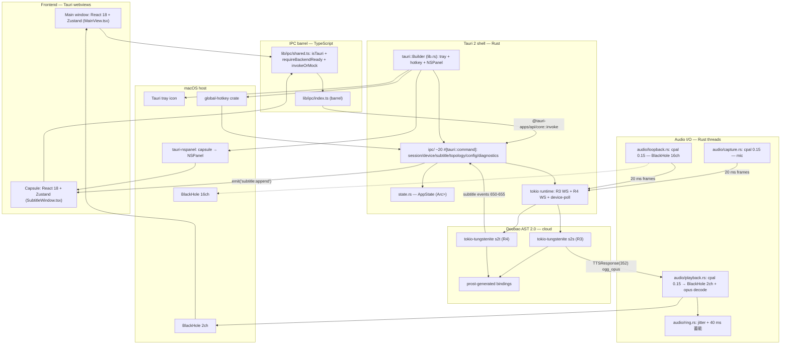

# 01 · Architecture (v0)

> Scope: top-level architecture for the parent project's v0 release — a macOS-first
> open-source real-time EN↔ZH interpreter that competes with 金喜同声传译双通道版
> (`.scratch/macos-siminterpret-poc/map.md` L12). Defines the Tauri 2 + React 18 +
> TypeScript 5.6 + Vite 6 shell, the Rust-heavy backend split, the dual-WS data
> paths (R3 s2s outbound + R4 s2t inbound), and the 4-device BlackHole wiring on
> macOS. Sibling: `docs/spec/v0/00-overview.md` (planned) — sets the destination,
> acceptance numbers, and v0/v1/v2 cascade roadmap.
>
> Hard constraints carried from research:
> - **No code copied from Open-Less** (`openless-take.md` §6 "AGPL dual-license trap")
>   — borrow architecture and patterns only.
> - **v0 first-sound ≤ 3000 ms** (`latency-budget-v0.md` §1.1; `map.md` L17 v0 PoC
>   ≤ 4s is the floor, the 3s budget is the locked Round-2 target per the brief).
> - **Doubao AST 2.0** (`poc-docs-take.md` §3 endpoint row) is the only model at v0;
>   v1 cascade is deferred but the seams must be present (`map.md` L24, L109).
> - **macOS-first**; Windows is v1+ (`map.md` L26, L46, L135).

---

## 1. Top-level architecture diagram

The v0 system has three Rust-side boundaries (Tauri command surface, async
runtime, audio I/O threads) and one webview boundary (main window + capsule).
All network and audio work stays in Rust; the webview is a thin reactive shell.



Notes on what's **not** in the diagram:

- **No `ScreenCaptureKit`** at v0 — `poc-docs-take.md` §1.1 only proves mic
  capture; v0 B-channel is BlackHole 16ch + cpal loopback (Round-2 decision;
  `latency-budget-v0.md` §1.3 + App C). ScreenCaptureKit with
  `excludesCurrentProcessAudio=true` (`map.md` L37, L66) is the v1+ fallback.
- **No JS-side network calls.** All Doubao traffic in Rust — matches Open-Less
  CSP (`openless-take.md` §6 item 6).
- **No `pyogg` / `soundfile`** — decode path is the `opus` crate streaming
  into the ring (`latency-budget-v0.md` §3 stage 8 — the single biggest v0 win).

---

## 2. Process / thread model

The v0 process has **one main thread** (Tauri event loop), **one tokio
runtime** (multi-thread), and **one cpal audio thread per device**. The capsule
window is a separate Tauri-managed webview in the same Rust process.

| Thread / runtime | Responsibilities |
|---|---|
| Main thread (Tauri) | Tray, global-hotkey callbacks, NSPanel config, window lifecycle |
| Tokio runtime | R3 WS task (s2s), R4 WS task (s2t), device-poll, audio-session orchestration, command handlers |
| cpal capture — mic | 16 kHz mono, 20 ms frames → uplink ring |
| cpal playback — BlackHole 2ch | Pulls from jitter ring, `cpal::Stream::play` @ 48 kHz native |
| cpal loopback — BlackHole 16ch | 48 kHz → 16 kHz resample → R4 uplink ring |
| Main webview (UI) | React + Zustand; renders MainView; invokes IPC barrel |
| Capsule webview (UI) | React + Zustand; renders SubtitleWindow; listens `subtitle:append` |

IPC handlers: **~20 `#[tauri::command]`** for v0 (Open-Less has 195 per
`openless-take.md` L139; v0 is dual-channel only so 20 covers session + device
+ subtitle + topology + config + diagnostics without the boilerplate explosion
the user wants to avoid — §9 [REVIEW] #3).

Shared `AppState` (`state.rs`) holds `Arc<Mutex<…>>` for: active sessions,
device config, ring config (40 ms initial, 20–40 ms adaptive), and a cost
meter. R4 → webview subtitle events flow via `app.emit("subtitle:append", …)`
— same pattern as Open-Less's `microphone:level` (`openless-take.md` L138).

---

## 3. Module layout (proposed)

```
realtime_interpreter/
├── src-tauri/
│   ├── src/
│   │   ├── main.rs                  # calls lib::run()
│   │   ├── lib.rs                   # tauri::Builder + tray + hotkey + NSPanel
│   │   ├── ipc/                     # ~20 #[tauri::command] (§6)
│   │   │   ├── mod.rs               # generate_handler! list
│   │   │   ├── session.rs device.rs subtitle.rs topology.rs config.rs diagnostics.rs
│   │   ├── audio/
│   │   │   ├── capture.rs           # cpal input stream (mic)
│   │   │   ├── playback.rs          # cpal output + opus decode + ring pull
│   │   │   ├── loopback.rs          # B-channel BlackHole 16ch capture
│   │   │   ├── resample.rs          # 48k → 16k (rubato)
│   │   │   └── ring.rs              # Arc<Mutex<VecDeque<i16>>> jitter + 40 ms 蓄能
│   │   ├── doubao/
│   │   │   ├── client.rs            # tokio-tungstenite session manager (R3 + R4)
│   │   │   ├── proto.rs             # prost-generated bindings
│   │   │   ├── auth.rs              # 2-header X-Api-Key + X-Api-Resource-Id
│   │   │   ├── s2s.rs               # R3 pipeline (capture → WS → opus → playback)
│   │   │   ├── s2t.rs               # R4 pipeline (loopback → WS → subtitle emit)
│   │   │   └── event.rs             # 100/150/200/211/212/220-222/230/351/352/650-655/900/901/999
│   │   ├── platform/macos.rs        # tauri-nspanel convert, BlackHole detection
│   │   ├── state.rs                 # AppState (Arc<Mutex<...>> shared)
│   │   └── error.rs                 # unified AppError → serde::Serialize
│   ├── tauri.conf.json              # multi-window; macOS Overlay + trafficLightPos; CSP strict
│   ├── capabilities/{default,capsule}.json
│   └── Cargo.toml                   # tauri 2.11, cpal 0.15, opus, tokio-tungstenite, prost, global-hotkey, tauri-nspanel
├── src/                             # React 18 + TS 5.6 frontend
│   ├── main.tsx                     # router by ?window=main|capsule
│   ├── App.tsx                      # root; selects MainView or SubtitleView
│   ├── store/                       # Zustand (replaces Open-Less Context; openless-take.md §6 item 2)
│   │   ├── session.ts devices.ts subtitles.ts topology.ts config.ts
│   ├── lib/ipc/                     # IPC barrel (Open-Less pattern; openless-take.md L136)
│   │   ├── shared.ts                # isTauri + requireBackendReady + invokeOrMock
│   │   ├── session.ts device.ts subtitle.ts topology.ts config.ts diagnostics.ts
│   │   └── index.ts                 # single import surface
│   ├── components/                  # DeviceSelector / SubtitleWindow / LatencyMeter (openless-take.md L149)
│   │                               # TopologyCheckPanel / SessionControls / StatusBadge
│   └── views/                       # MainView.tsx / SubtitleView.tsx
├── public/{index.html,icons/}
├── package.json                     # tauri-apps/api 2.x, react 18.3.1, vite 6, zustand 5
└── vite.config.ts                   # react() plugin only (openless-take.md L96-100)
```

Notes:
- **`realtime-interpreter-core`** crate (`openless-take.md` §6 item 1) is
  **deferred** — Round-2 locked Tauri-only; today's structure already keeps
  `doubao/` + `audio/` + `state.rs` framework-free (only `ipc/` touches
  `tauri::command`), so the split is mechanical when v1 adds Linux egui or
  headless CLI.
- **Cargo pinning**: `tauri = "2.11"` exact (`openless-take.md` L58);
  `tauri-plugin-shell = "2.3.5"` exact (CVE per `openless-take.md` L130).

---

## 4. Data flow — R3 A-channel (one full cycle)

User speaks CN; meeting listener hears the user's own voice saying the EN
translation in ≤3000 ms. Timing per `latency-budget-v0.md` §2.

1. **Capture** (`audio/capture.rs`, cpal 0.15) — mic @ 48 kHz;
   `BufferSize::Fixed(256)` = 5.3 ms hw buffer (`latency-budget-v0.md` App C
   stage 1); 20 ms frames (960 samples); source rate header = 16000, server
   resamples (`poc-docs-take.md` §3 "Audio input spec"). *Budget: 10 ms.*
2. **VAD + AGC** (inline in `capture.rs`) — RMS tap on the same cpal stream
   (VAD adds no queue, `latency-budget-v0.md` §3 stage 2); AGC peak-tracker,
   target −16 dBFS, attack 5 ms / release 100 ms / limiter −3 dBFS
   (`poc-docs-take.md` §3 stage 3). *Budget: 5 ms.*
3. **Uplink** (`doubao/client.rs`, `tokio-tungstenite`) — preconnected at app
   start (TLS amortized during splash); binary `TaskRequest(200)` 80 ms frames
   = 2560 B; 30 s keep-alive ping. Endpoint
   `wss://openspeech.bytedance.com/api/v4/ast/v2/translate`, `mode=s2s`,
   `source_language=zh`, `target_language=en`, `speaker_id=""`,
   `denoise=false`, `format="ogg_opus"` (PCM not honored per `poc-docs-take.md`
   §4.1). Auth: 2-header `X-Api-Key` + `X-Api-Resource-Id` (`poc-docs-take.md`
   §3). *Budget: 50 ms.*
4. **Doubao AST 2.0 S2S inference** (cloud) — hard ceiling, FLAL 2.21s per
   `latency-budget-v0.md` §1.4 + `15-jinxi-architecture-reverse.md` L33. 1 s
   warmup probe at app start saves ~100 ms cold-start (`latency-budget-v0.md`
   §3 stage 5). *Budget: 2100 ms.*
5. **Downlink** (`doubao/s2s.rs`) — first `TTSResponse(352)` arrives with
   ogg_opus chunk; strip 2-byte `OpusHead` from first packet of each sentence,
   feed each chunk straight to the `opus` decoder — **no wait for
   `TTSSentenceEnd(351)`** (`latency-budget-v0.md` §3 stage 8; PoC's
   `soundfile` whole-sentence path explicitly rejected per `poc-docs-take.md`
   §2 + §4.1). *Budget: 40 ms.*
6. **Opus stream decode** (`audio/playback.rs`, `opus 0.3`) —
   `Decoder::new(48000, opus::Channels::Stereo)`; per-chunk ≈ 0.06 ms
   (`latency-budget-v0.md` App C stage 8). Push PCM to ring. *Budget: 5 ms.*
7. **Jitter buffer + 蓄能** (`audio/ring.rs`) —
   `Arc<tokio::sync::Mutex<VecDeque<i16>>>` with 40 ms initial fill (vs PoC's
   120 ms per `poc-docs-take.md` §2); adaptive expansion to 40 ms when RTT
   jitter > 20 ms. *Budget: 40 ms.*
8. **Virtual sound card playback** (`audio/playback.rs`, cpal 0.15) —
   `cpal::Stream::play` to **BlackHole 2ch** @ 48 kHz native (avoids PoC's
   44.1/48 mismatch bug per `poc-docs-take.md` §1). Meeting app picks up
   BlackHole 2ch as its mic input. *Budget: 20 ms.*
9. **End-to-end**: 10 + 5 + 50 + 2100 + 40 + 5 + 40 + 20 = **2270 ms floor**;
   2400 ms operating point = **2570 ms**. Both ≤ 3000 ms with 230–730 ms
   headroom (`latency-budget-v0.md` §2.1).

```mermaid
sequenceDiagram
  autonumber
  participant U as User (CN)
  participant Mic as cpal capture (audio/capture.rs)
  participant Tokio as tokio runtime
  participant WS as tokio-tungstenite (doubao/client.rs)
  participant DB as Doubao AST 2.0 (S2S)
  participant Dec as opus decoder (audio/playback.rs)
  participant Ring as jitter ring (audio/ring.rs)
  participant BH as cpal playback → BlackHole 2ch
  participant Meet as Meeting app (mic = BH 2ch)

  U->>Mic: voice (analog)
  Note over Mic: 5.3 ms hw buffer; 20 ms frames @ 48k
  Mic->>Tokio: i16 frames (rate=16000 hdr)
  Tokio->>WS: TaskRequest(200) binary proto
  WS->>DB: wss://openspeech.../translate (s2s)
  Note over DB: AST 2.0 inference ~2100 ms FLAL
  DB-->>WS: TTSResponse(352) ogg_opus chunks
  WS->>Dec: stream each chunk (no TTSSentenceEnd wait)
  Dec->>Ring: 48kHz PCM i16 (~20 ms each)
  Ring->>BH: 40 ms initial fill, then adaptive pull
  BH->>Meet: 48kHz native, BH 2ch output
  Meet-->>U: meeting listener hears EN in user's voice
```

---

## 5. Data flow — R4 B-channel (one full cycle)

Other party speaks EN in the meeting; user sees bilingual EN/ZH subtitles in
the floating capsule.

1. **Loopback capture** (`audio/loopback.rs`, cpal 0.15) — open **BlackHole
   16ch** as cpal input; meeting app's output is routed there (or via a
   Multi-Output Device). *Topology pre-flight required — see §7.*
2. **Resample** (`audio/resample.rs`, `rubato`) — 48 kHz → 16 kHz mono so the
   same `source_audio` protobuf header works as R3 (`poc-docs-take.md` §3 +
   `02_项目架构与技术栈.md` L104). *Cost: ~2 ms.*
3. **Uplink** (`doubao/client.rs`) — separate WS, `mode=s2t`,
   `source_language=en`, `target_language=zh`, `denoise=true` (toggleable per
   `poc-docs-take.md` §5 Q16), `enableTts=false`
   (`02_项目架构与技术栈.md` L105 + L710 — R4 is subtitle-only). *Budget: 50 ms.*
4. **Doubao AST 2.0 S2T inference** (cloud) — S2T FLAL 2.12s zh-en per
   `18-local-mt-models.md` via `map.md` L88; ~1.2 s streaming per
   `15-jinxi-architecture-reverse.md` L59. WS emits 650–655 subtitle events
   (`poc-docs-take.md` §5 Q13). *Budget: 1200 ms.*
5. **Downlink** (`doubao/s2t.rs`) — 650/651/652 (SourceSubtitle) +
   653/654/655 (TranslationSubtitle) parsed into
   `Subtitle { id, timestamp, speaker, sourceText, translationText, isFinal }`
   per `02_项目架构与技术栈.md` L714–722. *Budget: 40 ms.*
6. **IPC emit** (`doubao/s2t.rs` → `ipc/subtitle.rs`) — Rust task calls
   `app.emit("subtitle:append", payload)`, same pattern as Open-Less's
   `microphone:level` (`openless-take.md` L138). Main + capsule webviews
   both listen.
7. **Zustand subtitle store** (`store/subtitles.ts`) — append to bounded ring
   (max 200 lines); capsule `SubtitleView.tsx` re-renders. *Budget: 50 ms RTT.*
8. **End-to-end R4**: 100 + 2 + 50 + 1200 + 40 + 50 ≈ **1442 ms**, well under
   the B-channel budget of 2500 ms (`poc-docs-take.md` §1.2).

```mermaid
sequenceDiagram
  autonumber
  participant Other as Other party (EN)
  participant Meet as Meeting app (output = BH 16ch)
  participant BH16 as BlackHole 16ch
  participant Loop as cpal loopback (audio/loopback.rs)
  participant Res as rubato resample (audio/resample.rs)
  participant Tokio as tokio runtime
  participant WS as tokio-tungstenite (doubao/client.rs)
  participant DB as Doubao AST 2.0 (S2T)
  participant Emit as app.emit('subtitle:append', …)
  participant Cap as Capsule webview (store/subtitles.ts)

  Other->>Meet: voice (analog)
  Meet->>BH16: EN audio (via Multi-Output Device)
  BH16->>Loop: 48 kHz multi-channel
  Loop->>Res: mono channel extract
  Res->>Tokio: 16 kHz mono i16 frames
  Tokio->>WS: TaskRequest(200) binary proto
  WS->>DB: wss://openspeech.../translate (s2t)
  Note over DB: AST 2.0 S2T inference ~1200 ms FLAL
  DB-->>WS: 650/651/652 (source) + 653/654/655 (translation)
  WS->>Emit: Subtitle struct (id, ts, spk, src, trans, isFinal)
  Emit->>Cap: 'subtitle:append' Tauri event
  Cap-->>Cap: Zustand ring append; SubtitleView re-render
```

**Anti-feedback discipline** (per `map.md` L66 + L124–128 + the T21 wiki
synthesis at `map.md` L100): R3's BlackHole 2ch output is **not** routed back
into the R4 BlackHole 16ch input. The 3-misconception self-check in
`topology.rs` validates this at startup and warns the user if violated.

---

## 6. IPC surface (~20 commands)

Each entry is one `#[tauri::command]` + one typed wrapper under
`src/lib/ipc/<domain>.ts`. Grouped by file under `src-tauri/src/ipc/`.

- **`ipc/session.rs` (5)** — `session::start_s2s` opens R3 WS + capture thread;
  `session::stop_s2s` stops capture/playback + closes WS; `session::start_s2t`
  opens R4 WS + loopback; `session::stop_s2t` stops loopback; `session::get_status`
  returns both-channel state (idle / connecting / active / error).
- **`ipc/device.rs` (4)** — `device::list` enumerates inputs + outputs
  (`coreaudio-sys` on macOS); `device::set_mic`, `device::set_output` (BlackHole
  2ch), `device::set_loopback` (BlackHole 16ch) each persist a device id.
- **`ipc/subtitle.rs` (2)** — `subtitle::subscribe` registers a webview listener
  for `subtitle:append` events; `subtitle::get_recent` returns last N entries
  for capsule cold-start hydration.
- **`ipc/topology.rs` (2)** — `topology::check` runs the 4-device pre-flight +
  3-misconception self-check (`map.md` L124–128); `topology::get_status` returns
  cached status so UI re-renders don't re-probe.
- **`ipc/config.rs` (3)** — `config::get` returns full config (API key masked;
  keyring-backed per `openless-take.md` L37); `config::set` validates + persists
  (keyring for API key, JSON for the rest); `config::validate` runs the auth
  probe (port of `auth_test.py` per `poc-docs-take.md` §6).
- **`ipc/diagnostics.rs` (4)** — `diagnostics::run_latency_probe` plays 1 s
  through BlackHole 2ch → captures BlackHole 16ch → measures end-to-end BlackHole
  + CoreAudio HAL latency; `diagnostics::collect_logs` bundles sanitized logs
  (no audio, no API key); `diagnostics::get_cost` returns running USD/hour
  estimate; `diagnostics::reset_cost` resets the meter.

**Total: 20 commands.** Lean vs Open-Less's 195 (`openless-take.md` L139) — the
Round-2 target (§9 [REVIEW] #3).

---

## 7. macOS-specific patterns

### Floating subtitle window via `tauri-nspanel`

The capsule webview is converted to a non-activating `NSPanel` at runtime so
it can sit above another app's full-screen Space on macOS — the Open-Less
pattern at `openless-take.md` L123 + `lib.rs:614`. Reference points (no code
copied): `openless-all/app/src-tauri/src/lib.rs:539` (initial NSPanel
conversion), `:614` (capsule-specific), `:2430,2452` (focus / Space
behavior). In v0, `src-tauri/src/platform/macos.rs::convert_capsule_to_nspanel`
is called once during `lib::run()` after the webview is built. NSPanel flags:
`nonactivatingPanel = true`, `floating`, `becomesKeyOnlyOnClick`,
`worksWhenModal`.

### Multi-window `tauri.conf.json` + CSP

Mirrors Open-Less (`openless-take.md` §5 "Window topology"): **`main`** =
1240×800, `hiddenTitle`, `transparent`, `titleBarStyle: "Overlay"`,
`trafficLightPosition` per Open-Less `tauri.conf.json:15-32`; **`capsule`** =
460×180, `alwaysOnTop`, `decorations: false`, `focus: false`, `skipTaskbar:
true`, `transparent`. URL routes via `index.html?window=capsule` (same trick
as Open-Less `App.tsx:28-53`, `openless-take.md` L95).

CSP per `openless-take.md` §6 item 6: `script-src 'self'`, `connect-src 'self'
ipc: http://ipc.localhost http://localhost:1420 ws://localhost:1420`,
`object-src 'none'`, `frame-ancestors 'none'`. Webview opens no external
connections — all Doubao / API traffic is Rust.

### BlackHole detection

`platform/macos.rs::enumerate_blackhole_devices` queries CoreAudio via
`coreaudio-sys` (transitive dep of `cpal` 0.15 on macOS). Match: device name
contains `"BlackHole"` + channel count == 2 (or 16). IDs persist via
`config::set`.

### 原声直出 toggle (skip B-channel translation)

`MainView.tsx` toggle routes B-channel loopback directly to headphones/speaker,
bypassing the R4 S2T WS + subtitle pipeline. Implemented as a cpal passthrough
stream (`audio/playback.rs::route_loopback_passthrough`) at ~20 ms, no network.
Saves 100% of B-channel API cost per `03_性能与成本分析.md` L241
(`poc-docs-take.md` §4.3); also the lowest-cost demo path for validating
4-device wiring without API quota.

### Pre-flight topology check

`topology::check` runs at app start + on demand: (1) confirm mic input exists;
(2) confirm BlackHole 2ch exists (R3 output); (3) confirm BlackHole 16ch /
alternate loopback exists (R4 input); (4) confirm headphones/speaker exists
(原声直出 output); (5) **3-misconception self-check** per `map.md` L124–128 —
① R3 output VAC ≠ R4 input VAC; ② meeting app mic input = R3 output VAC (not
real mic); ③ other party's translated output → real headphones only; (6)
optional 1 kHz tone probe: route 1 s through BlackHole 2ch → capture from
BlackHole 16ch → assert RMS > threshold (mirrors `check_voicemeeter.py` per
`poc-docs-take.md` §7 + `05-realtime-voice-translator-deep-read.md` L72).
Returns structured `TopologyStatus`; UI renders red/amber/green panel and
refuses to start a session until amber or green.

---

## 8. Open-Less borrowing checklist

Architecture and pattern-level adoption only — no code copied from
`openless-all/app/src-tauri/src/` or `crates/openless-core/src/`, both
**AGPL-3.0-only** (`openless-take.md` L13, §6 item 1).

- ✅ **IPC barrel shape** (`openless-take.md` L136 + §6 item 3) — 7 files in v0
  (one per domain + `shared.ts` + `index.ts`).
- ✅ **`lib/ipc/shared.ts`** isTauri + `requireBackendReady` + `invokeOrMock`
  (`openless-take.md` L137 + §6 item 2). v0 contract version = `"1.0.0"`.
- ✅ **Multi-window `tauri.conf.json`** (`openless-take.md` §5 "Window
  topology") — `main` (hiddenTitle, transparent, titleBarStyle=Overlay) +
  `capsule` (alwaysOnTop, decorations=false, focus=false, skipTaskbar,
  transparent).
- ✅ **AudioBars 5-envelope pattern** (`openless-take.md` L149) → `LatencyMeter.tsx`;
  envelope `[0.55, 0.85, 1.0, 0.85, 0.55]` and `Math.pow(easedVoice, 0.42)`
  are physics-of-visualization constants.
- ✅ **System tray** (`openless-take.md` §5 "System tray", `lib.rs:781-810`) —
  `TrayIconBuilder::with_id("main-tray")`, dynamic menu rebuild.
- ✅ **Global hotkey via `global-hotkey`** (`openless-take.md` §5 "Global
  hotkeys", `Cargo.toml:80` + `lib.rs:829`) — Carbon on macOS, side-modifier
  aware; default v0 hotkey: Right Option (matches Open-Less `USAGE.md:71`).
- ❌ **NO code copied** from `openless-all/app/src-tauri/src/` or
  `crates/openless-core/src/` (AGPL-3.0-only). Patterns + constants only;
  all Rust source written fresh.
- ❌ **NO 270-line Context** (`openless-take.md` §6 item 2). v0 uses Zustand
  stores from day one, scoped to 5 small stores (§3).

---

## 9. [REVIEW] decisions needed

Open choices surfaced by the architecture that need user confirmation before
§03-implementation begins.

- **[REVIEW] B-channel audio capture**: BlackHole 16ch + Aggregate Device (PoC
  pattern per `02_项目架构与技术栈.md` L497–524) vs dedicated virtual device per
  session (cleaner routing, more setup). *Recommendation: BlackHole 16ch +
  Aggregate Device for v0; per-session device deferred to v1+.*

- **[REVIEW] Floating subtitle window**: `tauri-nspanel` (Open-Less pattern at
  `openless-take.md` L36 + `lib.rs:614`) vs SwiftUI `NSPanel` via Tauri plugin
  vs plain webview with `always_on_top` (simpler but fails on macOS full-screen
  Spaces). `tauri-nspanel` is a git dep on branch `v2` (unreleased per
  `openless-take.md` §7 Q1) but the only known-working full-Space path.
  *Recommendation: `tauri-nspanel` for v0; vendor a fork if upstream stays
  unstable.*

- **[REVIEW] IPC count**: 20 commands (~lean, Round-2) vs ~50 (~Open-Less
  granularity, finer type safety). 20 covers session × 2 + device × 4 +
  subtitle + topology + config + diagnostics without composite commands; 50
  would split `session::start_s2s` into 3 sub-commands. *Recommendation: 20 for
  v0; revisit when commands cross ~40.*

- **[REVIEW] Capture rate**: 48 kHz native + `rate=16000` in Protobuf header
  (recommended per `latency-budget-v0.md` §3 stage 1) vs 16 kHz direct (PoC
  pattern per `poc-docs-take.md` §3). 48 kHz saves client-side resample but
  trusts the server to downsample. *Recommendation: 48 kHz native — verify
  server accepts `source_audio.rate` mismatch at integration time.*

- **[REVIEW] Stage 7 initial fill**: 40 ms (tighter, click risk on wifi) vs
  60 ms (safer, uses 20 ms of budget) per `latency-budget-v0.md` App E #3.
  *Recommendation: 40 ms with adaptive expansion; document "wired recommended"
  in the setup guide.*

---

## 10. References

- `docs/research/openless-take.md` (218 lines) — primary GUI architecture
  reference; Tauri 2 stack, IPC barrel shape, multi-window config, NSPanel,
  tray, global hotkey; license boundary at §6 item 1.
- `docs/research/poc-docs-take.md` (309 lines) — what the PoC validated vs
  admitted as unknown; endpoint, event codes, auth scheme, audio format,
  BlackHole install, 200–500 ms opus whole-sentence cost.
- `docs/research/latency-budget-v0.md` (203 lines) — per-stage waterfall,
  hard ceiling on Doubao S2S inference, 40 ms initial jitter fill, 5 ms
  opus stream-decode target, recovery actions if v0 measures > 3 s.
- `docs/spec/v0/00-overview.md` — planned sibling (destination, acceptance
  numbers, v0/v1/v2 cascade roadmap; not yet written).
- `.scratch/macos-siminterpret-poc/map.md` (153 lines) — destination +
  wayfinder map; dual-channel destination, M2 MacBook Air sole hardware,
  BlackHole routing, 3-misconception self-check, v1 cascade seam.
- `AGENTS.md` (21 lines) — workspace conventions; GitHub issue tracker,
  triage labels, domain docs pattern, `realtime_interpreter_Minimal_Implementation/`
  git-ignore rule.

---

(End of `01-architecture.md` draft — Round 2 of v0 spec, 2026-09-06)
