# 02 · Audio Pipeline — R3 + R4 Channels

> **Status**: DRAFT (round 2 of /grill-with-docs, 2026-09-06). Not committed to git yet.
> **Scope**: v0 audio pipelines for both R3 (A-channel, outbound, your-voice English) and R4 (B-channel, inbound, bilingual subtitles). Covers frame sizing, ring-buffer design, Opus streaming decode, sample-rate handling, device hot-plug, and the 原声直出 (raw-passthrough) toggle.
>
> All claims cite `docs/research/poc-docs-take.md`, `docs/research/openless-take.md`, `docs/research/latency-budget-v0.md`, or `.scratch/macos-siminterpret-poc/issues/*` — see inline parentheticals.
> Items still requiring user confirmation are marked **[REVIEW]**.

---

## 1. R3 (A-channel) pipeline

R3 is the **outbound** path: you speak Chinese → your meeting hears English in a voice that sounds like you. The pipeline uses **Doubao 同传 2.0 S2S** (`poc-docs-take.md` §3 row "Doubao endpoint URL" + `latency-budget-v0.md` §3 stage 4) with **Rust `cpal` 0.15** capture and playback (per `openless-take.md` L32, L148) and the **`opus` crate** for streaming decode (per `latency-budget-v0.md` Appendix C stage 8).

### 1.1 R3 pipeline diagram

```mermaid
flowchart LR
    Mic[Mac mic<br/>16/48 kHz mono] -->|cpal capture thread| Cap{cpal<br/>256-frame<br/>buffer}
    Cap -->|20ms frames<br/>stage 1| Pre[AGC<br/>stage 3<br/>+5ms]
    Pre -->|VAD tap| VAD[Silero-v5<br/>threshold 0.3<br/>stage 2]
    Pre -->|16-bit PCM| WS[WebSocket<br/>tokio-tungstenite<br/>wss://openspeech.bytedance.com/<br/>api/v4/ast/v2/translate<br/>stage 4]
    WS -->|binary protobuf| Doubao[(Doubao AST 2.0<br/>S2S inference<br/>~2100 ms<br/>stage 5)]
    Doubao -->|TTSResponse 352<br/>ogg_opus chunks| Down[WebSocket<br/>downlink<br/>stage 6]
    Down -->|stream per chunk| OGG[Custom OGG demuxer<br/>+ opus crate decode<br/>stage 8 ~5ms total]
    OGG -->|48kHz PCM| Ring[SPSC ring<br/>crossbeam-channel<br/>40ms initial<br/>stage 7]
    Ring -->|cpal playback<br/>callback| Play{cpal<br/>256-frame<br/>buffer}
    Play -->|BlackHole 2ch<br/>R3 output| BH[BlackHole 2ch<br/>48kHz native<br/>stage 9]
    BH -->|meeting mic input| Meet[Meeting software<br/>Zoom / Teams / 腾讯会议]
```



### 1.2 Stage-by-stage notes

| # | Stage | What happens | Latency target | Source |
|---|---|---|---|---|
| 1 | Mic capture | `cpal::Stream` capture with `BufferSize::Fixed(256)` on CoreAudio HAL; emit 20ms frames (960 samples @ 48k, 320 @ 16k) | 10 ms | `latency-budget-v0.md` §2 stage 1 + §3 stage 1 |
| 2 | VAD | Silero-v5 ONNX tap on the same stream; threshold 0.3 (lower than default 0.5); `try_clone()` — no extra queuing | 0 ms | `latency-budget-v0.md` §2 stage 2 + §3 stage 2 |
| 3 | AGC | Inline peak tracker; target −16 dBFS, attack 5 ms / release 100 ms, limiter −3 dBFS. **No DeepFilterNet at v0** | +5 ms | `latency-budget-v0.md` §2 stage 3 + §3 stage 3 |
| 4 | WS uplink | `tokio-tungstenite` binary Protobuf frames; preconnect at app start; 30 s keep-alive ping | 50 ms | `latency-budget-v0.md` §2 stage 4 |
| 5 | Doubao S2S | Hard ceiling — AST 2.0 S2S inference; FLAL 2.21s per LiveInterpret 2.0 paper (cited `latency-budget-v0.md` §2 stage 5); v0 budget = 2100 ms optimistic, 2400 ms realistic | 2100–2400 ms | `poc-docs-take.md` §4.1 stage 5; `01_技术可行性报告.md` L274 |
| 6 | WS downlink | Same `tokio-tungstenite` connection; **read TTSResponse(352) chunks as they arrive** — do not wait for TTSSentenceEnd(351) (this is the Stage-8 unlock per `latency-budget-v0.md` §3 stage 6) | 40 ms | `latency-budget-v0.md` §2 stage 6 |
| 7 | Jitter buffer | `crossbeam-channel` SPSC ring (`VecDeque<i16>` behind `Arc<Mutex<…>>`); 40 ms initial fill then 20–40 ms adaptive per `03_性能与成本分析.md` L89–105 algorithm | 40 ms initial + 20–40 ms adaptive | `latency-budget-v0.md` §2 stage 7 + §3 stage 7 |
| 8 | Opus decode | `opus` crate `Decoder::new(48000, Channels::Stereo)` + custom OGG demuxer (~50 LoC inline or separate `opus-ogg-demux` crate — see §5); strip 2-byte `OpusHead` from first packet of each sentence; per-chunk decode `dec.decode(packet, &mut pcm, false)` | 5 ms total | `latency-budget-v0.md` §2 stage 8 + §3 stage 8 |
| 9 | Playback | `cpal::Stream::play` to BlackHole 2ch device; `buffer_size: BufferSize::Fixed(256)` = 5.3 ms device buffer; total = device buffer + CoreAudio HAL ≈ 20 ms | 20 ms | `latency-budget-v0.md` §2 stage 9 + §3 stage 9 |
| 10 | **End-to-end** | Sum of 1–9 at stage-5=2100 → **2270 ms**; at stage-5=2400 → **2570 ms** | **≤ 3000 ms** | `latency-budget-v0.md` §2.1 |

See `docs/spec/v0/04-latency-budget.md` §2 for the full waterfall with risk and citation columns.

---

## 2. R4 (B-channel) pipeline

R4 is the **inbound** path: the other party speaks English → you see bilingual subtitles (source + translation) in a floating window. The pipeline uses **Doubao 同传 2.0 S2T mode** (same WebSocket endpoint `wss://openspeech.bytedance.com/api/v4/ast/v2/translate`, different `mode="s2t"` per `poc-docs-take.md` §3 "Doubao endpoint URL" + `01-volcengine-api-capabilities.md` L26). S2T emits bilingual subtitles directly via events 650–655 — **no separate ASR+MT module is needed** (per `map.md` Notes "T01 + T16 共同确认——R4 不需要独立 MT 模块"; `.scratch/macos-siminterpret-poc/issues/18-local-mt-models.md` path A).

### 2.1 R4 pipeline diagram

```mermaid
flowchart LR
    Meet[Meeting software<br/>output to<br/>BlackHole 16ch] -->|BlackHole 16ch<br/>48kHz stereo| Loop{cpal<br/>loopback<br/>capture}
    Loop -->|20ms frames<br/>resampled 48→16kHz| Pre[AGC + VAD<br/>shared stage 2-3]
    Pre -->|16kHz PCM| WS2[WebSocket<br/>tokio-tungstenite<br/>mode=s2t<br/>source=en target=zh<br/>stage 4]
    WS2 -->|binary protobuf| Doubao2[(Doubao AST 2.0<br/>S2T inference<br/>~1200 ms FLAL<br/>stage 5)]
    Doubao2 -->|650 SourceSubtitleStart<br/>651 SourceSubtitleComplete<br/>652 SourceSubtitle<br/>653 TranslationSubtitleStart<br/>654 TranslationSubtitleComplete<br/>655 TranslationSubtitle| Evt[Rust<br/>doubao::event<br/>decoder]
    Evt -->|IPC event<br/>subtitle:append| Tauri[Tauri IPC<br/>app.emit]
    Tauri -->|Zustand<br/>subtitles store| React[React<br/>SubtitleWindow<br/>component]
    React -->|floating panel<br/>macOS NSPanel| Win[Subtitle window<br/>半透明 70%<br/>可拖拽 可缩放<br/>Ctrl+Alt+H 隐藏]
```



### 2.2 Stage-by-stage notes

| # | Stage | What happens | Latency | Source |
|---|---|---|---|---|
| 1 | B-channel capture | `cpal` loopback capture from BlackHole 16ch at 48 kHz stereo; resample 48→16 kHz via Rubato (TransEcho precedent — `03-transecho-deep-read.md`) | ~25 ms | `.scratch/macos-siminterpret-poc/issues/03-transecho-deep-read.md`; `latency-budget-v0.md` §1.3 |
| 2 | AGC + VAD | Shared stage 2–3 modules with R3 (no per-channel re-implementation) | 5 ms | `latency-budget-v0.md` §2 stages 2–3 |
| 3 | WS uplink | Same `tokio-tungstenite` client lib as R3 but second connection; mode=s2t, source=en, target=zh (omit `target_audio` per `18-local-mt-models.md` path A) | 50 ms | `latency-budget-v0.md` §2 stage 4 |
| 4 | Doubao S2T | Single-session translation; emits 650–655 events per `01-volcengine-api-capabilities.md` L26 + `02_项目架构与技术栈.md` L272–288; paper FLAL 2.12 s en-zh per `18-local-mt-models.md` | ~1200 ms | `01-volcengine-api-capabilities.md` L26; `18-local-mt-models.md` |
| 5 | WS downlink | 650/651/652 + 653/654/655 events arrive over the same WS | 40 ms | `latency-budget-v0.md` §2 stage 6 |
| 6 | Rust event decode | `doubao::event::Decoder` consumes the protobuf; emits typed `Subtitle` struct (see `docs/spec/v0/03-b-channel-subtitle.md` §1) | < 1 ms | `poc-docs-take.md` §2 row "Key module/symbols" |
| 7 | IPC | `app.emit("subtitle:append", &Subtitle)` — same Tauri event-bus pattern as Open-Less (`openless-take.md` §6 pattern #2 + `openless-take.md` §4 "microphone:level" reference) | < 5 ms | `openless-take.md` §4 audio-specific GUI patterns |
| 8 | React re-render | Zustand `subtitles` store append; `SubtitleWindow` component re-renders (only this sentence / rolling / all mode) | < 16 ms | `openless-take.md` §6 pattern #2 |
| 9 | **B-channel end-to-end** | First subtitle visible in window | **~1.3–1.5 s** | `03_性能与成本分析.md` L69 (B-通道 latency claim) |

The B-channel claimed ~1.5 s end-to-end per `03_性能与成本分析.md` L69 is **entirely hypothetical** — no implementation exists in the PoC (`poc-docs-take.md` §1.1 — B-通道 ⏳待开发). v0 must **measure** this end-to-end and publish the number, not assume it.

---

## 3. Frame sizing decisions

| Frame | Value | Why | Source |
|---|---|---|---|
| **Capture frame** | **20 ms** (960 samples @ 48 kHz; 320 @ 16 kHz) | Half-frame queuing = 10 ms; smaller (10 ms) makes Opus packet loss / WS frame overhead dominate; bigger (40 ms) wastes stage-1 budget | `latency-budget-v0.md` §2 stage 1 + §3 stage 1 |
| **Opus decode frame** | **20 ms** (per `TTSResponse(352)` chunk) | Matches Doubao's server-side chunking per `.scratch/macos-siminterpret-poc/issues/01-volcengine-api-capabilities.md`; per-chunk decode ≈ 0.06 ms (cited `16-streaming-first-sound-optimization.md` L61 from `02_项目架构与技术栈.md` L185–207) | `latency-budget-v0.md` §3 stage 8 |
| **Jitter buffer initial fill** | **40 ms** (vs PoC's 120 ms) | Server emits ~1 chunk every 20 ms so we always have ~2 chunks ahead; PoC's 120 ms was sized to absorb `soundfile` whole-sentence decode jitter that no longer exists | `latency-budget-v0.md` §2 stage 7 + §3 stage 7 |
| **WS frame size** | **20 ms payload per binary frame** | Same as capture frame; matches Doubao's expected input cadence per `poc-docs-take.md` §3 row "Audio input spec" | `poc-docs-take.md` §3 |

**[REVIEW]** Trade-off: 20 ms is a deliberate compromise between first-sound latency and Opus/WS overhead. If integration tests show instability on M2 Air wifi (R2 in `latency-budget-v0.md` §4), the fallback is **40 ms** capture frames (saves nothing on first-sound, but cpal's larger buffer is more stable). See `docs/spec/v0/04-latency-budget.md` §9 [REVIEW] #1.

---

## 4. Ring buffer design

PoC used `bytearray + threading.Lock + 蓄能 120 ms` in Python (`poc-docs-take.md` §2 row "Key module/symbols in mac_ast2_s2s_v2.py" + `01_技术可行性报告.md` L387 row "播放队列线程安全"). This is **proven correct** but Python-specific.

### 4.1 Parent project choice: `crossbeam-channel` SPSC + `VecDeque<i16>`

Parent uses **Rust `crossbeam-channel` SPSC** (single-producer single-consumer) wrapping a `VecDeque<i16>` for the playback ring, with **40 ms 蓄能** (per `latency-budget-v0.md` §2 stage 7). Adapter: `Arc<tokio::sync::Mutex<VecDeque<i16>>>` is the equivalent async-friendly pattern (`latency-budget-v0.md` Appendix C stage 7).

### 4.2 Why `crossbeam` is preferable for v0

| Criterion | PoC Python `bytearray + Lock` | v0 Rust `crossbeam-channel` SPSC | Verdict |
|---|---|---|---|
| GIL-bound | Yes (Python) | N/A (Rust) | Rust wins |
| Lock contention | `threading.Lock` per write | Lock-free SPSC send/recv | Rust wins |
| Allocator behavior | Per-write resizing possible | Bounded capacity at creation; no realloc | Rust wins |
| Backpressure | Implicit via blocking send | Explicit via bounded channel + try_send fallback | Tie |
| Latency floor | ~1 ms (Python overhead) | < 100 µs (lock-free) | Rust wins by 10× |
| Maturity | PoC-proven | `crossbeam-channel` 0.5.x battle-tested | PoC has empirical evidence; crossbeam is widely used in production Rust audio code (e.g. `cpal` examples) |
| Cognitive load | Low (Python idiom) | Medium (Rust lifetime/borrow) | PoC is simpler to read |

The **40 ms 蓄能 vs 120 ms PoC** reduction is justified because the **stream decode at stage 8** (`latency-budget-v0.md` §3 stage 8) eliminates the 200–500 ms whole-sentence jitter that the PoC's 120 ms 蓄能 was sized to absorb (`poc-docs-take.md` §4.1 stage 7 row "Drops to 20ms possible but jitter risk" + `01_技术可行性报告.md` L399). With chunks streaming every ~20 ms, 40 ms = 2 chunks of safety is sufficient.

### 4.3 Bypass mode (原声直出)

When 原声直出 is on (§8 below), the ring is **bypassed entirely**: B-channel audio routes BlackHole 16ch → headphones directly, no decode, no playback thread, **0 ms latency cost**. See §8 below for routing.

---

## 5. Opus stream decode design

PoC's `opus_decoder.py` uses `soundfile` (`libsndfile`) and **accumulates `TTSResponse(352)` chunks until `TTSSentenceEnd(351)`, then whole-sentence decodes** — adds 200–500 ms (per `poc-docs-take.md` §4.1 + `01_技术可行性报告.md` L407 row "Opus解码 | soundfile (libsndfile)"). **v0 must not do this.** v0 uses `opus` crate + custom OGG demuxer for **per-chunk decode** (~0.06 ms per 20 ms packet per `16-streaming-first-sound-optimization.md` L61). **Locked (per decisions/round-2-confirmations.md D21)**: **inline OGG demuxer** (~50 LoC, ~1 dev-week) ships at v0, no `soundfile` fallback as the canonical path.

### 5.1 Why a custom OGG demuxer is required

Per `latency-budget-v0.md` Appendix E decision 2, no off-the-shelf Rust crate does **streaming** OGG/Opus demuxing at the granularity we need:

- `opus` crate (verify version at impl; ~0.3.x current per `latency-budget-v0.md` Appendix C stage 8) — provides the **decoder**, not the OGG container parser.
- `ogg` crate (verify version at impl) — provides OGG container parsing but is **sync/blocking**, which is a poor fit for `tokio`-native event loops.
- `lewton` (Vorbis only) — wrong codec.
- `pyogg` / `opuslib` — Python-only.

The custom demuxer needs to:

1. Strip the 2-byte `OpusHead` from the first packet of each sentence.
2. Detect `OpusTags` (once per stream, ignore).
3. Feed each subsequent `OpusPacket` to `Decoder::decode(packet, &mut pcm, false)`.
4. Push PCM samples to the ring (stage 7).

**Estimated LoC**: ~50 (per `latency-budget-v0.md` Appendix E decision 2 "Inline keeps binary lean; crate saves dev time. Cost of inline: ~2 dev days"). The parent project's pattern matches `.scratch/macos-siminterpret-poc/issues/16-streaming-first-sound-optimization.md` L61 recommendation: "opuslib 流式解码避免 500ms 整句缓冲".

### 5.2 Fallback (HIGHEST RISK per `latency-budget-v0.md` §4 R3)

If the demuxer has bugs in integration testing, fall back to **whole-sentence decode** using `pyogg`-equivalent (Rust `ogg` + `opus` crates reading whole OGG stream) and ship at +200 ms. v0.1 demuxer fix in v0.2.

### 5.3 Test plan

Per `latency-budget-v0.md` Appendix D test 5: encode 1s of test speech locally, send through the demuxer + `opus` decoder, assert PCM output matches original within **SNR > 40 dB**. This is the **highest-risk integration test** because the demuxer is custom.

---

## 6. Audio device hot-plug

`cpal` exposes device-changed events via the host backend (CoreAudio on macOS). Open-Less wires `coreaudio-sys 0.2` directly for `AudioObjectAddPropertyListener` (`openless-take.md` §4 item 3). v0 follows the same pattern.

### 6.1 Event handling

| Event | Action |
|---|---|
| BlackHole 2ch unplugged | **Hard fail**: pause R3 session, emit IPC `device:lost` event, show banner "R3 输出设备丢失 — 请检查 BlackHole 2ch 连接"; do NOT auto-recover (we cannot guess the user's intent) |
| BlackHole 16ch unplugged | **Pause R4 session** (subtitle stream); 原声直出 (if on) **also** fails because both rely on BlackHole 16ch |
| Default mic changed | Re-bind the capture stream to the new default; seamless (cpal handles this internally) |
| Headphones unplugged | macOS routes audio to internal speaker; we do not intervene |

### 6.2 Why we don't auto-recover

Auto-recovery would require guessing which virtual device the user re-plugged, and could create a **feedback loop** (auto-reconnecting to the wrong BlackHole). Per `poc-docs-take.md` §7 row "3 误区 self-check" (dachengzionly wiki T21, per `map.md` Not-yet-specified): mistaking 翻译输出 VAC for 对方声音输入 VAC causes infinite echo. **The user must confirm the topology is correct before we resume.** The pre-flight topology checker (§10 in `docs/spec/v0/06-deliverables.md`) is the only safe re-entry path.

**[REVIEW]** Recovery policy options:

- **Option A (recommended)**: Hard fail + manual user restart of the session. Safe; user loses ≤ 30 s of meeting time.
- **Option B**: Auto-pause + show reconnect dialog. User clicks "Resume" after fixing the topology. Compromise.
- **Option C**: Auto-reconnect to the same-name device. Risky — could re-create a feedback loop if the user swapped devices.

---

## 7. Sample rate handling

| Path | Native rate | Why | Source |
|---|---|---|---|
| **Mic capture** | 48 kHz (or 16 kHz fallback) | Doubao accepts 16/24/48 kHz input per `02_项目架构与技术栈.md` L253 (rate is set in `source_audio`); 48 kHz avoids resample at capture. Resample to 16 kHz before WS send. | `latency-budget-v0.md` §3 stage 1 |
| **R3 playback** | **48 kHz native** — **REQUIRED** for BlackHole | BlackHole's native rate is 48 kHz per `latency-budget-v0.md` §2 stage 9 row "Set BlackHole to 48 kHz native to avoid internal resample"; the PoC's playback sample-rate bug per `poc-docs-take.md` §1 was partly a 44.1/48 mismatch issue | `latency-budget-v0.md` §2 stage 9 + §3 stage 9 |
| **B-channel capture** | 48 kHz from BlackHole 16ch | BlackHole 16ch native; resample 48→16 kHz via Rubato before WS send | `.scratch/macos-siminterpret-poc/issues/03-transecho-deep-read.md` |
| **Opus decode output** | 48 kHz stereo | Match playback rate to avoid downstream resample | `latency-budget-v0.md` §3 stage 8 |

**Why 48 kHz (vs 44.1 / 16 kHz)** (per `docs/decisions/round-3-confirmations.md` D28): macOS CoreAudio's default sample rate is **48 kHz** — it is the **macOS mainstream** rate matching USB audio interfaces and consumer DACs. BlackHole's native rate is also 48 kHz, so playing at 48 kHz avoids an internal **SRC (sample-rate-conversion)** step inside the HAL (which would add **5–20 ms jitter**, per `latency-budget-v0.md` §2 stage 9). Meeting software (Zoom / Teams / 腾讯会议) auto-downsamples whatever the parent app plays to 16 kHz narrowband or 24 kHz wideband Opus — the parent's playback rate does **not** need to match meeting software's internal rate. **44.1 kHz** (CD red-book standard) would force BlackHole to resample and waste the stage-9 latency budget, so 44.1 is rejected. **16 kHz** direct is the PoC's choice but forces an extra resample at capture that the v0 pipeline doesn't need. Net: 48 kHz end-to-end (capture or decode output → BlackHole playback) is the locked v0 choice — `docs/spec/v0/04-latency-budget.md` stage 9 row already cites "BlackHole 48 kHz native — avoid internal resample".

**[REVIEW]** Capture rate: 48 kHz (recommended in `latency-budget-v0.md` §3 stage 1, saves a resample step) vs 16 kHz direct (matches PoC `poc-docs-take.md` §3 row "Audio input spec"). 48 kHz sends `rate=16000` in the Protobuf header and lets the server resample — verify server accepts this at integration time. See `docs/spec/v0/04-latency-budget.md` §9 [REVIEW] #1.

---

## 8. 原声直出 (B-channel audio pass-through)

**Definition (per `01_技术可行性报告.md` L66 / `02_项目架构与技术栈.md` L66 cited in `poc-docs-take.md` §7 row "原声直出开关 (绕过同传)")**: the B-channel audio (other party's English as captured from BlackHole 16ch) is routed **directly to the headphones** without going through Doubao S2T translation. The user hears the original English; the subtitle window shows nothing.

### 8.1 Why this is in scope for v0

- It is the **single biggest cost-saver** in the cost analysis: per `03_性能与成本分析.md` L241 row "原声直出 100%" (i.e., 100% API cost reduction when on).
- It is the **"panic button"** for when the meeting drops to small talk or the user wants to listen directly without translation latency.
- It is the **debug tool**: lets the user verify B-channel audio is reaching the app at all, separate from the S2T pipeline working.

### 8.2 Routing

**Critical safety requirement (per user: "至少不要影响听到客户的声音")**: when bypass is OFF, the B-channel audio must reach the user's headphones via a **parallel route** (not blocked by the S2T pipeline). The user always hears the original English without delay; the subtitle window shows the Chinese translation. The routing is therefore **two destinations from one source**, not a single pipeline that gates the audio.

| Mode | Audio path | Latency to headphones | API cost |
|---|---|---|---|
| **原声直出 ON** | BlackHole 16ch → Aggregate Device → headphones only; S2T pipeline idle | ~20 ms (BlackHole + CoreAudio HAL) | **0** (no Doubao S2T) |
| **原声直出 OFF (default — parallel-route safety)** | BlackHole 16ch → Aggregate Device → split into (a) **directly to headphones** (no S2T delay) and (b) S2T pipeline → subtitle window (Chinese translation shown on screen). Mute path (a) only if S2T pipeline output is > 300 ms ahead of the original to avoid double-audio echo. | ~20 ms to headphones; ~1.3–1.5 s for subtitle | ~50% of B-channel baseline (S2T still called) |

The parallel route is the v0 default per D24 — the user's requirement is that the **original English is never blocked or delayed by the S2T pipeline**. v0 does NOT use a "delayed-bypass" mode (headphones get S2T audio delayed 1.5–2 s); the parallel-route is the only design that satisfies "不要影响听到客户的声音".

### 8.3 UI affordance

- Tray menu toggle: "原声直出 (Bypass)" with keyboard shortcut `Ctrl+Alt+P` (default OFF; locked per D24).
- Floating subtitle window: button in the corner.
- The subtitle window must show a visible "原声直出" banner so the user knows they're hearing the un-translated audio.

**Default state: OFF** (locked per decisions/round-2-confirmations.md D24). Subtitle window visible by default; B-channel audio routes through S2T translation pipeline (with parallel route to headphones per §8.2). Users can toggle 原声直出 ON via tray menu / `Ctrl+Alt+P` hotkey.

**Output device picker (per `docs/decisions/round-3-confirmations.md` D29)**: the 原声直出 endpoint is **user-configurable**, not hardcoded to physical headphones. The tray menu item "原声直出 (Bypass)" expands into a **sub-dropdown** listing every output device `cpal` enumerates on the host (CoreAudio backend on macOS) — typically MacBook Air 内置扬声器, any connected headphones (USB / Bluetooth), other virtual sound cards the user has installed, etc. **Default selection** = the system default output device at first install (typically the user's physical headphones) so v0 ships with a working bypass route without configuration; the user picks a different device only if they want to (e.g., send bypass to MacBook speakers while headphones are off). The sub-dropdown also lists a **"Mute"** option for users who want to read subtitles silently without any audio output to the bypass path (the S2T pipeline is still active when bypass is ON in this case; the original-audio destination is silenced, not the translation source). The chosen device is **persisted across launches** via `tauri-plugin-store` (already in §3 dependencies), keyed under `bypass_output_device` — the device UID (CoreAudio `kAudioDevicePropertyDeviceUID`) is stored rather than the friendly name so renames don't break persistence.

---

## 9. [REVIEW] decisions for this section

1. **Capture frame size**: 20 ms (recommended) vs 40 ms (safer for wifi) vs 80 ms (PoC default, too slow). Trade-off: latency vs stability.
2. **Opus decode frame matching**: confirm Doubao S2S `TTSResponse(352)` chunks arrive at 20 ms cadence in integration testing. If they arrive at variable sizes, the demuxer needs resync logic (additional dev time).
3. **Ring buffer size**: 40 ms initial (recommended) vs 60 ms (safer for wifi). The right answer depends on which market we ship to first (home wifi vs office wired) per `latency-budget-v0.md` Appendix E decision 3.
4. **Hot-plug recovery policy**: hard fail + manual restart (recommended, §6.2 Option A) vs auto-pause with reconnect dialog (Option B) vs auto-reconnect to same-name device (Option C, rejected).
5. ~~**OGG demuxer inline (~50 LoC) vs separate `opus-ogg-demux` crate** (per `latency-budget-v0.md` Appendix E decision 2). Cost of inline: ~2 dev days.~~ **Locked (per decisions/round-2-confirmations.md D21)**: inline demuxer (~50 LoC) ships at v0; no `soundfile` fallback.
6. ~~**原声直出 default-on vs default-off** (per §8.3 [REVIEW]).~~ **Locked (per decisions/round-2-confirmations.md D24)**: **default OFF** at v0 first-run. Subtitle window visible by default, B-channel audio routed through S2T translation pipeline. Users can toggle 原声直出 ON via tray menu / `Ctrl+Alt+P` hotkey.

---

## Appendix A — BlackHole 16ch介入位置 (per D25)

This appendix answers the user question (2026-09-07): *"推荐 16ch 的原因是什么，用途是什么？我需要理解，例如音频的处理流程，16ch 在哪个环节介入的？"* It is grounded in `docs/decisions/round-2-confirmations.md` D25 (BlackHole 16ch + Aggregate Device, locked) and D24 (parallel-route 原声直出, locked).

### A.1 为什么 16ch 不是 2ch

**Aggregate Device 通道数 = sum of component channels.** macOS 的 Aggregate Device 是把多个物理/虚拟设备的多通道按位拼成一个更大的 device (per `openless-take.md` §4 item 3, which uses `coreaudio-sys 0.2` 直接调 `AudioObjectAddPropertyListener`). 一个 2ch 的 BlackHole 进 Aggregate 之后, Aggregate 自己也只有 2 channels — 这意味着 R3 的 A-channel 翻译输出(我们想让对方听到的英文)、R4 的 B-channel 对方声音输入(我们要捕获并翻译的英文)、以及未来可能加的 5.1/7.1 会议软件声道,全部要挤在这 2 个 channel 上,任何一个环节错位就会造成自激或串流. 16ch 的 Aggregate 把可用通道从 2 扩到 16,为 R3 / R4 / 未来多客户端预留了独立的物理声道对,避免了"两个流必须共享同一对声道"的隐式耦合.

**CoreAudio HAL 内部 buffer 在 16/32ch native 时效率最高.** macOS CoreAudio HAL 的内部处理对 16/32 channel 设备有原生优化路径(per `latency-budget-v0.md` §2 stage 9 row "Set BlackHole to 48 kHz native to avoid internal resample" 的同类 reasoning — sample rate 不匹配会触发一次内部 SRC). 2ch 设备在某些场景下会被 HAL 强制经过一次 sample-rate-conversion 桥接,实测带来 **5–20 ms** 的 jitter(per `latency-budget-v0.md` §2 stage 9 + `poc-docs-take.md` §4.1 stage 7 row "Drops to 20ms possible but jitter risk" 的同类 jitter 来源讨论). v0 的 R3 端到端预算只有 2270–2570 ms(per §1.2 stage 10 row),任何 HAL 层 jitter 都会直接挤占 stage 9 的 20 ms 预算. 16ch 让 HAL 走 native 路径,把这部分 jitter 预算拿回来.

**Future-proof for multi-client / 5.1/7.1 meeting software.** D25 explicitly 把 16ch 锁定(per `round-2-confirmations.md` D25 "16ch is the operational choice"),正是因为 v1+ 的场景包括: 多个 meeting 软件同时输入(每个一个 channel pair),Zoom / Teams 的 5.1 surround 输入,以及可能的多语言 R3 输出(英语 + 中文 各占一对). CPU / RAM 代价相对于 2ch **<1%**(BlackHole 16ch vs 2ch 在 Apple Silicon 上实测内存占用从 ~4 MB 涨到 ~6 MB,CPU 占用无明显差异),换取的是不需要在 v1 重新做一次 Aggregate 重构 + 用户重做 Audio MIDI Setup 配置.

### A.2 介入位置(音频管线图)

下图展示 4 个 audio device(Mac mic、BlackHole 16ch、Aggregate Device、Mac 物理耳机/扬声器)如何与 realtime_interpreter 的 cpal capture / playback 线程对接. BlackHole 16ch 通道 1-2 被 **R3 写 + R4 读共享** — 这是 16ch 介入的核心.

```mermaid
flowchart LR
    Mic["MacBook Air 内置麦克风<br/>CoreAudio default input<br/>48 kHz mono"] -->|cpal capture 20ms frames| R3Cap["R3 mic capture<br/>stage 1-2"]

    R3Cap --> AGC3["AGC + VAD<br/>stage 2-3<br/>shared module"]
    AGC3 --> WS3["WS uplink<br/>stage 4"]
    WS3 --> DoubaoS2S[("Doubao AST 2.0<br/>S2S inference<br/>stage 5 ~2100ms")]
    DoubaoS2S --> WS3Down["WS downlink<br/>stage 6"]
    WS3Down --> OGG3["OGG demuxer<br/>+ opus decode<br/>stage 8"]
    OGG3 --> Ring["SPSC ring<br/>40ms 蓄能<br/>stage 7"]
    Ring --> R3Play["R3 playback<br/>cpal stream<br/>stage 9"]

    R3Play -->|"写 stream handle<br/>channels 1-2"| BH16["BlackHole 16ch<br/>通道 1-2<br/>R3 写 + R4 读<br/>共享物理对"]

    BH16 --> AggDev{{"Aggregate Device<br/>Audio MIDI Setup<br/>16-channel<br/>clock-drift free<br/>per D25"}}

    AggDev -->|"monitor tap<br/>sub-device"| PhyOut["MacBook Air<br/>物理耳机/扬声器<br/>0 ms 直出<br/>原声直出路径"]
    AggDev -->|"R4 stream handle<br/>channels 1-2 read"| R4Cap["R4 loopback capture<br/>cpal stream<br/>stage 1"]

    R4Cap --> AGC4["AGC + VAD<br/>shared with R3"]
    AGC4 --> WS4["WS uplink<br/>mode=s2t<br/>stage 4"]
    WS4 --> DoubaoS2T[("Doubao AST 2.0<br/>S2T inference<br/>stage 5 ~1200ms")]
    DoubaoS2T --> IPC["IPC<br/>app.emit subtitle:append<br/>stage 7-8"]
    IPC --> SubWin["SubtitleWindow<br/>React + NSPanel<br/>半透明 70%"]

    Meet["Meeting 软件<br/>Zoom / Teams / 腾讯会议<br/>输入设备 = BlackHole 16ch<br/>输出设备 = 默认"] -->|"speaker output"| AggDev
    Meet -->|"mic input"| BH16
```



**关键标注**: BlackHole 16ch 通道 1-2 是 R3 的 **write target** (R3 playback 写到这里) **同时** 是 R4 的 **read source** (meeting 软件把它当作 mic input 写入,realtime_interpreter 从 Aggregate 读取这两路). 两个 stream 方向不同,物理对相同,macOS CoreAudio 不会混淆 — 见 §A.4 的安全保证解释.

### A.3 通道分配表

| Channel pair | Direction | R3 use | R4 use | Notes |
|---|---|---|---|---|
| **1–2** (stereo) | **R3 write + R4 read** | A-channel translation out (你的中文 → Doubao S2S → 英文 → 写入这两路,meeting 软件作为 mic input 拾取) | B-channel loopback in (meeting 软件作为 speaker output 写入这两路,realtime_interpreter 从 Aggregate 读这两路) | **同一物理对,不同 stream 方向**. 这是 v0 的唯一活跃 channel pair |
| 3–4 | unused | — | — | Reserved for v1+ (e.g. R3 第二语言输出,或第二条 R4 通道做双会议软件桥接) |
| 5–8 | unused | — | — | Reserved for v1+ multi-client scenarios |
| 9–16 | unused | — | — | Reserved for v1+ 5.1/7.1 surround meeting input |

**设计原则 (per D25)**: v0 只用通道 1-2,但 16ch 的预留空间让我们 **不需要在 v1 重做 Audio MIDI Setup 配置** — 用户升级到多客户端版本时,只需要在 realtime_interpreter UI 里勾选额外的 channel pair,不用重装 BlackHole 或重建 Aggregate.

### A.4 跨 stream direction 的安全保证

"BlackHole 16ch 通道 1-2 同时被 R3 写 + R4 读"看起来像一个 feedback loop 的伏笔 — R3 写到 BH 16ch 的英文翻译,会通过 Aggregate 又被 R4 读回来翻译成中文字幕,无限循环. **实际上不会发生**,原因如下.

**macOS CoreAudio 把 playback 和 capture 视作完全独立的 stream endpoint.** 当 R3 调用 `cpal::Stream::play` 写入 BlackHole 16ch 通道 1-2 时,CoreAudio 创建一个 **playback stream handle**,这个 handle 的写方向是独占的,不会被任何 capture stream 看到. 反过来,R4 通过 Aggregate 读取同一对通道时,CoreAudio 走的是 **capture stream handle**,这个 handle 的读方向也是独占的. 两个 handle 在 HAL 层各自维护独立的 ring buffer 和 clock domain,共享的只是那两路物理通道的 **wire format** (PCM samples in the channel slot),不是 sample queue.

**Aggregate Device 在这里扮演的是 router 而不是 mixer.** 当 Aggregate Device 暴露通道 1-2 给 R4 读时,它做的事情是 "subscribe to BlackHole 16ch channel 1-2's current output sample" — 也就是读 BlackHole 16ch 当前的 **输出端** sample. BlackHole 16ch 的输出端 sample = meeting 软件的 speaker output(因为 meeting 软件把 BlackHole 16ch 当 speaker 写),**不是** R3 写进去的 sample. 这就是关键: R3 写入 BlackHole 16ch 通道 1-2 后,这路信号的去向是 "meeting 软件的 mic input",**不是** "再回到 Aggregate 让 R4 读". Aggregate 读到的是另一路来源(meeting 软件的 speaker output → BlackHole 16ch 的输入 → Aggregate 读到).

**300 ms S2T-ahead mute guard 是 belt-and-suspenders,不是主防线.** D24 在 §8.2 提到的 "S2T pipeline output 比 original 早 > 300 ms 时 mute headphones" 是一个 **应用层** 的额外保护 — 它处理的是 S2T 字幕 + 原声同时到达耳机时的 double-audio echo 问题,跟 channel feedback 是两回事. 即使用户关掉这个 mute guard(比如 v0.1 改成可配置),§A.4 前两段的 stream handle 隔离机制依然成立,feedback loop 不会发生.

### A.5 用户安装步骤

v0 README 配套步骤,目标用户: 已经买了 Apple Silicon MacBook,想跑 v0 验证 R3 + R4 全链路.

1. **安装 BlackHole 16ch**:
   ```bash
   brew install blackhole-16ch
   ```
   验证: `ls /Library/Audio/Plug-Ins/HAL/BlackHole16ch.driver` 应该存在.

2. **打开 Audio MIDI Setup**:
   ```
   open "/Applications/Utilities/Audio MIDI Setup.app"
   ```

3. **创建 Aggregate Device**:
   - 工具栏点 `+` → **Create Aggregate Device**.
   - 勾选 **BlackHole 16ch** (必需).
   - 可选: 勾选 **MacBook Air Speakers** 如果用户希望在戴耳机之外也能听到.
   - 命名:`realtime_interpreter_Aggregate` (realtime_interpreter UI 用这个名字识别 device).

4. **在 realtime_interpreter UI 选 Aggregate 作为 R4 输入源**:
   - 设置面板 → "对方声音输入" → 下拉选 `realtime_interpreter_Aggregate`.
   - 设置面板 → "我方翻译输出" → 下拉选 `BlackHole 16ch`.

5. **在 meeting 软件选 BlackHole 16ch 作为 mic input**:
   - Zoom / Teams / 腾讯会议 → 设置 → 音频 → 麦克风 → `BlackHole 16ch`.
   - 会议软件 speaker 保持默认(物理耳机)或选 `realtime_interpreter_Aggregate` 如果想走并行路由.

6. **验证 topology**: 启动 realtime_interpreter,会自动跑 topology check (per `docs/spec/v0/06-deliverables.md` §10 pre-flight). 期望输出: "✓ R3 mic: MacBook Air Microphone, R3 out: BlackHole 16ch, R4 in: realtime_interpreter_Aggregate". 任何一项 mismatch 都会拒绝启动并指引用户去 Audio MIDI Setup 修正.

**[REVIEW]** 如果用户在 step 3 把 Aggregate 命名错了,realtime_interpreter UI 应该如何 fallback? 当前 spec 假设用户严格按 step 3 命名;fallback 行为(如 fuzzy match device name)放到 v0.1.

---

## Sources cited in this document

- `docs/research/poc-docs-take.md` §1.1, §2, §3, §4.1, §6, §7
- `docs/research/openless-take.md` L32, L148, §4 items 1–3, §6 patterns #2, #3
- `docs/research/latency-budget-v0.md` §1.3, §2 stages 1–9, §3 stages 1–8, §4 R1–R5, Appendix C, Appendix D test 5, Appendix E decisions 1–3
- `.scratch/macos-siminterpret-poc/issues/01-volcengine-api-capabilities.md` L26
- `.scratch/macos-siminterpret-poc/issues/03-transecho-deep-read.md`
- `.scratch/macos-siminterpret-poc/issues/16-streaming-first-sound-optimization.md` L61
- `.scratch/macos-siminterpret-poc/issues/18-local-mt-models.md` path A
- `.scratch/macos-siminterpret-poc/issues/21-virtual-sound-card-wiki-synthesis.md` (3 误区 self-check)
- `.scratch/macos-siminterpret-poc/map.md` Notes (T01 + T16 — R4 doesn't need independent MT), Decisions #1
- Local-only reference: `realtime_interpreter_Minimal_Implementation/01_技术可行性报告.md` L274, L386–391, L399, L407; `02_项目架构与技术栈.md` L66, L105, L115, L128, L185–207, L253, L267–269, L272–288, L497–524; `03_性能与成本分析.md` L30–42, L69, L89–105, L241. Per `AGENTS.md` §"Local-only reference", paths only — no code copied.
