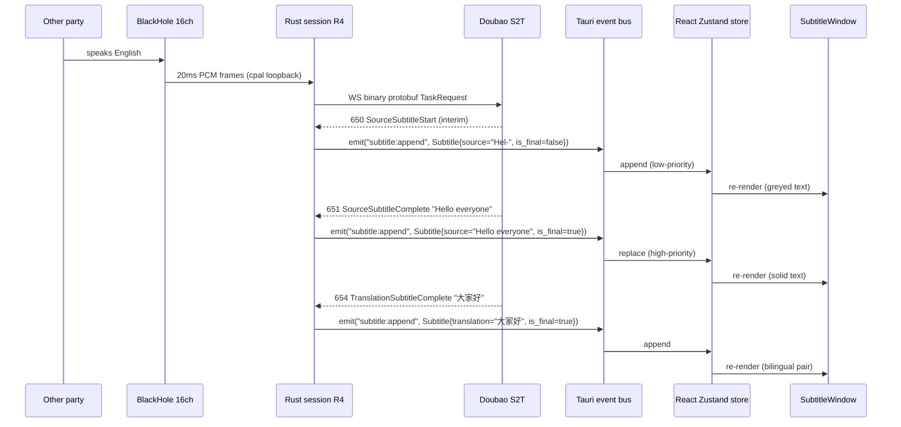

# 03 · B-Channel Subtitle — UX + Transport

> **Status**: DRAFT (round 2 of /grill-with-docs, 2026-09-06). Not committed to git yet.
> **Scope**: v0 B-channel (R4) — bilingual subtitle UX, transport from Doubao S2T, speaker identification, 原声直出 toggle integration.
>
> All claims cite `docs/research/poc-docs-take.md`, `docs/research/openless-take.md`, `docs/research/latency-budget-v0.md`, or `.scratch/macos-siminterpret-poc/issues/*` — see inline parentheticals.
> Items still requiring user confirmation are marked **[REVIEW]**.

---

## 1. Subtitle schema

The v0 `Subtitle` struct (single source of truth across Rust IPC and TypeScript Zustand store):

```rust
// Pseudocode — DO NOT copy code per AGENTS.md §"Local-only reference".
// Mirrors the schema in .scratch/macos-siminterpret-poc/02_项目架构与技术栈.md L714-722.
struct Subtitle {
    id: u64,                  // monotonic per session
    timestamp_ms: i64,        // wall-clock at S2T event receipt (Rust side)
    speaker: Speaker,         // Client | Unknown  -- see §6
    source_text: String,      // English (the other party's words)
    translation_text: String, // Chinese (or English->English passthrough)
    is_final: bool,           // false = Start event; true = Complete event
}
```

### 1.1 Event reconciliation (s2t mode emits 650–655)

Per `poc-docs-take.md` §5 Q13 reconciliation: s2t mode emits **6 event types** per subtitle pair, vs the s2s mode's 211/221. From `.scratch/macos-siminterpret-poc/issues/01-volcengine-api-capabilities.md` L26:

| Event code | Meaning | Sets `is_final` |
|---|---|---|
| 650 | SourceSubtitleStart | `false` (interim) |
| 651 | SourceSubtitleComplete | `true` |
| 652 | SourceSubtitle (delta) | `false` (interim) |
| 653 | TranslationSubtitleStart | `false` (interim) |
| 654 | TranslationSubtitleComplete | `true` |
| 655 | TranslationSubtitle (delta) | `false` (interim) |

The Rust `doubao::event::Decoder` matches events 650–655 in addition to the s2s events (100/150/200/351/352/999 — per `poc-docs-take.md` §3 row "Event codes the PoC handles"). v0 **must** handle both code sets because R3 (s2s) and R4 (s2t) sessions run concurrently.

### 1.2 IPC contract

Rust side emits per subtitle arrival:

```text
app.emit("subtitle:append", Subtitle { ... })
```

React side: Zustand `subtitles` store appends. The same Tauri event-bus pattern as Open-Less's `microphone:level` (`openless-take.md` §4 "Audio-specific GUI patterns"). No JSON wrapper — Tauri serializes the typed struct.

---

## 2. Subtitle window design

The floating subtitle window follows Open-Less's `capsule` pattern (`openless-take.md` §5 "Window topology" + `openless-take.md` §6 pattern #4 "Capsule window as the floating subtitle template"). Concrete shape, mapped to the parent's needs:

### 2.1 Tauri config (`tauri.conf.json` window block)

| Property | Value | Rationale | Source |
|---|---|---|---|
| Label | `subtitle` | Tauri window identifier | `openless-take.md` §5 |
| Width × Height | 720 × 220 | Wide enough for bilingual line pair | Open-Less capsule is 460×180; parent needs ~2× width for bilingual |
| `transparent` | `true` | Per PoC spec `02_项目架构与技术栈.md` L77 "悬浮字幕窗 半透明 70%" | `openless-take.md` §6 pattern #4 |
| `decorations` | `false` | No title bar — drag region is the body | `openless-take.md` §6 pattern #4 |
| `alwaysOnTop` | `true` | Must overlay any meeting UI | `openless-take.md` §6 pattern #4 |
| `skipTaskbar` | `true` | macOS convention for floating panels | `openless-take.md` §6 pattern #4 |
| `focus` | `false` | Click-through; doesn't steal keyboard focus from the meeting | `openless-take.md` §6 pattern #4 |
| `visible` | `false` (default) | Shown only when session starts | `openless-take.md` §5 capsule default |
| `titleBarStyle` | `Overlay` | macOS-specific; merges traffic-light buttons into the content | `openless-take.md` §5 + `openless-take.md` §2 macOS NSPanel gotcha |
| `trafficLightPosition` | `{ x: 12, y: 14 }` | macOS-specific; position the 3 buttons so they don't overlap subtitle text | Same |

### 2.2 macOS NSPanel conversion (mandatory for full-Space behavior)

Per `openless-take.md` §4 gotcha 1: "A plain Tauri window cannot sit above another app's full-screen Space on macOS. The capsule window is converted to a **non-activating NSPanel** at runtime via `tauri-nspanel`". Open-Less uses the `tauri-nspanel` crate at `openless-all/app/src-tauri/Cargo.toml:134` (git dep, branch `v2`). Parent v0 follows the **same pattern** (architecture, not code — per ADR-0011 in `docs/spec/v0/05-tech-stack-decisions.md`).

**Caveat**: `tauri-nspanel` is **not on crates.io** (git-only, per `openless-take.md` §7 question 1). The parent project must either:

- Accept the git dep (Open-Less's choice — works but adds supply-chain risk).
- Vendor the relevant `nspanel` glue (~150 LoC) into our own `realtime-interpreter-core` crate.
- Wait for a stable release on crates.io.

### 2.3 Interactivity

| Feature | How | Source |
|---|---|---|
| **可拖拽** | `-webkit-app-region: drag` on the subtitle text area CSS; `-webkit-app-region: no-drag` on buttons | Tauri's standard CSS regions |
| **可缩放** | `resizable: true` in `tauri.conf.json`; resize handle in bottom-right corner | Tauri default |
| **半透明 70%** | `opacity: 0.7` on the window root; toggle to 1.0 in settings | `02_项目架构与技术栈.md` L77 |
| **Ctrl+Alt+H 隐藏** | `global-hotkey` crate 0.6 (per `openless-take.md` §4 "Global hotkeys") bound to toggle window visibility | `02_项目架构与技术栈.md` L77 + `03_性能与成本分析.md` L246–249 |
| **字号可调** | Settings window slider; persists to JSON via `keyring`-backed config (per `openless-take.md` §1 "Persistence" row) | `02_项目架构与技术栈.md` L77 |
| **3 显示模式** | (a) only this sentence; (b) rolling (last 5 lines); (c) all | `02_项目架构与技术栈.md` L77 |

### 2.4 Position persistence

Window position saves to disk on move/resize (per `openless-take.md` §6 pattern #1 "openless-core framework-agnostic Rust crate" + persistence layer). On next session, restore last position. If the saved position is off-screen (e.g., external monitor disconnected), snap to default (center of primary display).

---

## 3. Subtitle streaming flow

End-to-end data path for a single subtitle arriving from the other party speaking English:



The Rust `doubao::event::Decoder` correlates 650→651 (source start→complete) and 653→654 (translation start→complete) on the same `id`. The `id` field in the S2T events is the **subtitle-pair id** within the session — v0 uses this directly as `Subtitle.id` (with the session prefix added on the Rust side to disambiguate across reconnects).

---

## 4. B-channel audio capture

The parent project's 4-device wiring is the UX model (per user Q10 screenshot; `00-overview.md` §1 dual-channel scope). Concretely:

| Device | Role | How it's used |
|---|---|---|
| **Mac mic** | A-channel input (R3 source) | `cpal` capture at 16/48 kHz |
| **BlackHole 2ch** | R3 output — meeting mic input | `cpal` playback at 48 kHz |
| **BlackHole 16ch** | B-channel input (R4 source) | `cpal` loopback capture at 48 kHz |
| **Headphones** | Local monitor + 原声直出 output | System default output |

### 4.1 Why BlackHole 16ch + loopback (NOT ScreenCaptureKit)

User decision Q10 (per round-2 lock): virtual sound card + 原声直出 model, **not** system capture. Rationale:

- **Topology is explicit**: each input/output device is a named entity the user can inspect in Audio MIDI Setup. The pre-flight topology checker (`poc-docs-take.md` §7 row "Pre-flight topology checker") can enumerate them and validate wiring.
- **No TCC permission prompts**: macOS ScreenCaptureKit triggers a screen-recording permission prompt on first use (per `06-macos-audio-routing-options.md` L44 "SCC 屏幕录制权限弹窗需 onboarding 文案"). BlackHole does not.
- **Predictable latency**: BlackHole is ~20 ms (`latency-budget-v0.md` §2 stage 9); ScreenCaptureKit on macOS 13+ is comparable but adds app-level mixing uncertainty.
- **原声直出 is naturally a hardware bypass** when BlackHole 16ch routes to headphones via Multi-Output Device — same data path with and without S2T.

The ScreenCaptureKit path (TransEcho's choice per `.scratch/macos-siminterpret-poc/issues/03-transecho-deep-read.md`) is **rejected for v0** because the user's 4-device wiring screenshot already commits to virtual sound cards.

### 4.2 Two sub-options for the B-channel capture

**[REVIEW]** (also surfaced in `03-b-channel-subtitle.md` §7 [REVIEW] #1):

- **Option A (recommended for v0)**: Single BlackHole 16ch as the **meeting software's output device** + Multi-Output Device sends the same audio to both (a) the cpal loopback capture for R4 and (b) the headphones for 原声直出. The meeting software sees BlackHole 16ch as its speaker; the user hears audio in headphones; R4 captures from BlackHole 16ch.
- **Option B**: Dedicated per-session virtual device (created/removed on session start/end). Cleaner isolation but the user must reconfigure the meeting software each session.

Option A is the PoC pattern (`poc-docs-take.md` §2 row "Virtual-audio-card strategy" mentions Multi-Output Device).

---

## 5. 原声直出 toggle

The 原声直出 toggle is the **cost-saver + panic button**. See `docs/spec/v0/02-audio-pipeline.md` §8 for the routing details (audio path, latency, cost). This section is the **UX integration** with the subtitle window.

### 5.1 Three toggle surfaces

1. **Tray menu** — `Open-Less /openless-take.md` §5 "System tray / menu bar" pattern. Item: "原声直出 (Bypass) [Ctrl+Alt+P]" with checkmark.
2. **Floating subtitle window** — small button in the corner; one-click toggle.
3. **Settings window** — checkbox with explanatory text "原声直出：跳过翻译，把对方原声直接送耳机（节省 API 费用 + 0 延迟）".

All three surfaces update the same Zustand `bypass` boolean; Rust listens via Tauri event `bypass:changed`.

### 5.2 Subtitle window behavior when bypass is ON

- Window shows a **prominent banner**: "原声直出 ON · 未翻译" (red or yellow background, high contrast).
- Subtitle text area is empty (no S2T calls being made).
- The level meter (if present) still shows B-channel audio amplitude so the user can confirm audio is reaching the app.

### 5.3 Audio routing when bypass toggles

| State | B-channel audio |
|---|---|
| OFF → ON | Rust stops sending `TaskRequest` frames to the Doubao S2T WS; closes the WS cleanly; routes BlackHole 16ch → headphones via Multi-Output Device (already configured) |
| ON → OFF | Rust opens a fresh Doubao S2T WS, resumes sending `TaskRequest` frames; Multi-Output Device routing unchanged |

**[REVIEW]** Default state: **default OFF** (safer for first-time users; they always see translation working and learn what the app does). Alternative: default ON per `03_性能与成本分析.md` L241 cost strategy. See `02-audio-pipeline.md` §8.3 [REVIEW] for the trade-off.

---

## 6. Speaker identification

Per `02_项目架构与技术栈.md` L714–722 schema, `Subtitle.speaker` is `'client' | 'unknown'` (PoC's enum; Open-Less doesn't have this concept because it's single-user dictation). Doubao S2T emits **speaker hints** in some events (per `poc-docs-take.md` §3 row "Event codes the PoC handles" + `.scratch/macos-siminterpret-poc/issues/01-volcengine-api-capabilities.md` event metadata); the Rust `doubao::event::Decoder` maps these to `Client` / `Unknown`.

### 6.1 v0 UI

- All B-channel subtitles show the tag **`[Speaker]`** by default (single-speaker assumption; the meeting has one "other party").
- A-channel subtitles (your own speech, R3 source) show **`[You]`** — but A-channel doesn't emit subtitle events in the user's spec (R3 is audio-only). If we ever show R3 source text, it would be `[You]`.
- The UI does **not** attempt voiceprint-based identification in v0. Per `02_项目架构与技术栈.md` L241 "Spk_chg 说话人识别 + 双语原文 spk_chg-driven split" — deferred to v1+ per `poc-docs-take.md` §7 row.

### 6.2 v1+ (deferred)

Voiceprint enrollment would let v1 distinguish `[Speaker A]` vs `[Speaker B]` in multi-party meetings. Out of scope for v0 (see `docs/spec/v0/06-deliverables.md` §5).

---

## 7. [REVIEW] decisions for this section

1. **B-channel audio capture method**: Option A (single BlackHole 16ch + Multi-Output, recommended for v0, simpler, matches PoC pattern) vs Option B (per-session virtual device, cleaner isolation, more setup friction). See §4.2.
2. **原声直出 default on/off**: Default OFF (recommended for first-time users) vs default ON (recommended by `03_性能与成本分析.md` L241 cost strategy). See §5.3.
3. **Subtitle window default position**: Center of primary display (recommended) vs last-saved position (could be off-screen if external monitor disconnected) vs under the menu bar (macOS convention). Snap-to-default on out-of-bounds is the recommended compromise.
4. **Subtitle auto-fade vs persistent scroll**: Auto-fade after N seconds (cleaner UI, but loses context) vs persistent scroll (PoC's `01_技术可行性报告.md` L390 "静音时持续输出上一句 — 加静音检测, 静音2秒后自动清空字幕" suggests auto-fade + clear-on-silence is the proven pattern). **Recommendation**: 3-line rolling buffer + clear-on-2s-silence.
5. **`tauri-nspanel` git dep**: Accept git dependency (Open-Less pattern) vs vendor nspanel glue into our own crate. See §2.2 caveat.
6. **Subtitle language pair lock**: v0 is hardcoded `source=en, target=zh` for B-channel (per `00-overview.md` §1 + map.md "destination 只锁中英"). v1+ might allow swap. No UI to change language in v0.

---

## Sources cited in this document

- `docs/research/poc-docs-take.md` §2 row "Virtual-audio-card strategy", §3 row "Event codes the PoC handles", §5 Q13, §7 row "Pre-flight topology checker"
- `docs/research/openless-take.md` §1 "Persistence", §2 macOS NSPanel gotcha, §4 "Audio-specific GUI patterns", §4 gotcha 1, §4 "Global hotkeys", §5 "Window topology", §5 "System tray / menu bar", §6 pattern #4, §7 question 1
- `docs/research/latency-budget-v0.md` §2 stage 9 (BlackHole 48 kHz native)
- `.scratch/macos-siminterpret-poc/issues/01-volcengine-api-capabilities.md` L26 (s2t 650–655 events)
- `.scratch/macos-siminterpret-poc/issues/03-transecho-deep-read.md` (BlackHole + Rubato precedent; ScreenCaptureKit rejected)
- `.scratch/macos-siminterpret-poc/issues/06-macos-audio-routing-options.md` L44 (SCC permission UX)
- `.scratch/macos-siminterpret-poc/issues/18-local-mt-models.md` path A (R4 = S2T single session)
- `.scratch/macos-siminterpret-poc/map.md` Notes (T01 + T16 — R4 doesn't need independent MT), "destination 只锁中英"
- Local-only reference: `02_项目架构与技术栈.md` L66, L77, L92, L105, L130, L131, L166, L173–174, L201–211, L213–216, L218–230, L241, L246–249, L497–524, L542, L547, L640–658, L714–722; `03_性能与成本分析.md` L69, L89–105, L100–102, L122–129, L131–137, L233–242, L241, L246–249; `01_技术可行性报告.md` L390. Per `AGENTS.md` §"Local-only reference", paths only — no code copied.
