<title>实时中英双向同传软件（音色克隆版）技术方案可行性报告</title>

> 部分内容由豆包生成

# 执行摘要

本报告针对"实时中英双向同传 + 克隆本人音色 + 虚拟麦克风回灌 Teams/Zoom（单侧部署、客户零安装）"的跨平台桌面软件需求，进行全面的技术可行性分析。经过对四类技术方案的对比调研、开源项目源码分析、商用成品（金喜同声传译）逆向参考、火山引擎豆包 AST 2.0 官方文档核验，得出以下核心结论：

<callout emoji="✅">
**技术可行**：基于火山引擎豆包 AST 2.0 端到端同传 API + 本地 DeepFilterNet 降噪 + 虚拟声卡回灌的架构，可实现端到端 2.6\~2.9s 的语音同传延迟，零样本音色克隆效果接近豆包 APP 体验，技术链路完整可落地。
</callout>

<callout emoji="💰">
**经济可行**：主要成本为同传 API 调用费用（按音频时长计费），单次1小时会议约为商用成品（金喜）月费的几十分之一；本地降噪、虚拟声卡、存储均为免费/开源方案。
</callout>

<callout emoji="💡">
**时间可行**：分5个阶段实施，最小验证版本（A通道同传）1\~2天可跑通，完整功能版本约4\~6周可交付。
</callout>

<callout emoji="💡">
**主要风险**：①模型推理延迟（\~2.2s）是当前技术物理极限，无法通过工程优化大幅降低；②零样本克隆在网络重连后可能出现音色漂移；③Mac 端系统音频回采配置较复杂，需做好自动化配置引导。
</callout>

# 项目背景与目标

## 项目背景

用户经常与海外客户通过 Teams/Zoom 进行商务会议，存在语言沟通障碍。现有解决方案（如实时翻译耳机、通用翻译 APP）存在以下痛点：

- **延迟高**：通用翻译 APP 需手动操作，端到端延迟 5s 以上，无法满足实时对话需求
- **音色不自然**：通用 TTS 音色机械，客户能明显听出是机器翻译，影响商务沟通体验
- **需要客户配合**：部分方案要求客户也安装软件或使用特定设备，落地困难
- **隐蔽性差**：使用翻译设备或 APP 界面明显，客户容易察觉，影响沟通信任
- **会议记录缺失**：现有方案无法自动记录会议音频和双语原文，会后整理困难

## 项目目标

开发一款跨平台（Windows/macOS）桌面软件，实现以下核心目标：

| 目标维度 | 具体要求 | 验收标准 |
|-|-|-|
| 实时同传 | 用户说中文→客户听英文；客户说英文→用户看中文字幕 | 端到端延迟 ≤3s，翻译准确率 ≥90% |
| 音色克隆 | 英文输出使用用户本人音色（零样本克隆） | 客户无法区分是真人还是AI翻译 |
| 单侧部署 | 仅用户安装软件，客户零安装、零感知 | 通过虚拟声卡回灌会议软件，客户侧无任何变化 |
| 跨平台 | 支持 Windows 10+ 和 macOS 12+ | 两个平台功能一致、体验统一 |
| 隐蔽性 | 客户无法察觉用户在使用同传软件 | 系统托盘常驻、无提示音、全局快捷键、字幕窗可隐藏 |
| 会议记录 | 自动记录会议音频和双语原文，支持AI纪要生成 | 可导出音频+Word/SRT/TXT/JSON，支持可配置AI Key生成纪要 |
| 降噪 | 本地实时降噪，抑制环境杂音干扰 | 输入干净→克隆输出干净，客户感受是真实对话 |

# 需求分析

## 功能需求

### 核心同传功能（P0）

- **A通道（中→英语音输出）**：采集用户麦克风→本地降噪→豆包 AST 2.0 s2s 同传（零样本克隆）→PCM 流式输出→虚拟声卡→会议软件麦克风→客户听英文
- **B通道（英→中字幕显示）**：回采会议软件扬声器（客户声音）→豆包 AST 2.0 s2t 同传→悬浮字幕窗实时显示原文+译文
- **本地降噪+AGC**：DeepFilterNet 实时降噪，自动增益控制，输入电平归一化
- **虚拟声卡回灌**：支持 Windows（VB-Cable）和 macOS（BlackHole/VB-Cable）虚拟声卡配置
- **术语库**：支持热词表和正则替换，确保专业术语翻译准确

### 控制面板功能（P0）

- **开始/停止**：控制同传会话生命周期
- **快停快开（暂停/恢复）**：保持 WebSocket 连接的暂停，恢复时 0 延迟继续
- **静音我方麦克风**：对方说话时关闭用户麦克风采集，避免环境噪音被翻译
- **静音对方麦克风**：用户说话时关闭对客户声音的采集，避免字幕干扰（不影响耳机听客户原声）
- **原声直出开关**：一键切换翻译/原声模式（客户说中文或有第三方加入时使用）
- **全局快捷键**：所有功能支持全局快捷键操作，无需打开软件界面

### 监控面板功能（P1）

- **连接状态**：未连接/连接中/已连接/重连中/异常
- **网络延迟**：WebSocket ping/pong RTT + 端到端延迟测量
- **会话时长**：从开始到现在的时间（暂停时停表）
- **翻译次数**：完成的句子数（A+B通道合计）
- **四通道电平表**：实时显示麦克风/翻译输出/对方输入/耳机输出的音量电平

### 会议记录功能（P1）

- **音频录制**：全程录制会议音频（用户声音+客户声音）
- **双语原文记录**：结构化存储时间戳+说话人+原文+译文
- **可配置 AI Key**：支持豆包/OpenAI/通义/DeepSeek/任何 OpenAI 兼容 API
- **自定义纪要模板**：提示词模板+输出格式+字段，预设+自建
- **一键生成纪要**：选模板+选模型→调用用户配置的 AI→生成
- **原始素材导出**：音频+Word 左右对照/SRT/TXT/JSON

### UI/UX 功能（P0/P1/P2）

- **系统托盘常驻**（P0）：主窗口默认最小化到托盘，点击展开
- **悬浮字幕窗**（P0）：半透明、可拖拽、可缩放、可隐藏，实时显示客户原文+译文
- **设置面板**（P0）：设备选择/音色/语言/快捷键/纪要配置
- **纪要历史页**（P1）：会议列表/回放/导出
- **设备自动检测与配置引导**（P1）：启动时自动扫描虚拟声卡，提供一键配置
- **清空按钮**（P2）：清空字幕内容和翻译次数

## 非功能需求

| 维度 | 要求 |
|-|-|
| 延迟 | A通道端到端 ≤3s（目标 2.6\~2.9s）；B通道字幕 ≤2s（目标 \~1.5s） |
| 稳定性 | 网络抖动不崩溃，自动重连（指数退避，最多3次），重连后音色尽量保持一致 |
| 资源占用 | CPU ≤15%（降噪+音频处理），内存 ≤200MB，网络带宽 ≤128kbps（双向） |
| 兼容性 | 支持 Zoom/Teams/腾讯会议/钉钉/飞书会议/Google Meet/OBS 等所有支持选择音频设备的会议软件 |
| 安全性 | API Key 本地加密存储；日志脱敏（不记录音频内容和翻译文本）；音频数据不落地（除用户主动录制） |
| 可维护性 | 模块化架构，引擎层与 UI 层分离；支持热更新配置；详细的错误日志和诊断信息 |

## 约束条件

- **必须使用云 API**：用户明确表态"延迟满足不了不如调云"，自建开源流水线延迟 3\~8s 不满足需求
- **必须克隆用户本人音色**：客户认识用户多年，需要保持音色一致性
- **必须单侧部署**：客户零安装、零感知
- **必须跨平台**：Windows + macOS
- **必须隐蔽**：不想让客户知道在使用同传软件
- **AST 2.0 不支持自定义训练音色**：官方文档确认指定音色模式仅支持 2 个公版音色，零样本克隆是唯一方案

# 技术选型对比

## 四类方案对比

| 方案 | 原理 | 延迟 | 音色克隆 | 成本 | 可行性 |
|-|-|-|-|-|-|
| **方案A：商用成品**   （金喜/讯飞同传） | 购买现成软件，直接使用 | 3\~4s   （实测） | 支持   （预训练音色） | 高   （月费/年费） | 即开即用，但无法定制、隐蔽性差、费用高 |
| **方案B：云API自研**   （豆包AST 2.0） | 调用火山引擎端到端同传API，自写音频路由和UI | 2.6\~2.9s   （PCM流式） | 支持   （零样本克隆） | 低   （按用量付费） | **推荐**：延迟最低、音色自然、可定制、成本可控 |
| **方案C：三段拼装**   （ASR+MT+TTS） | 分别调用语音识别、机器翻译、语音合成三个API | 4\~6s   （三次串行） | 支持   （需单独TTS克隆） | 中   （三次调用） | 延迟高、架构复杂、音色同步困难，不推荐 |
| **方案D：自建开源**   （FunASR+NLLB+CosyVoice） | 自建服务器部署开源模型，自写完整流水线 | 3\~8s   （受硬件限制） | 支持   （CosyVoice克隆） | 中   （服务器+电费） | 延迟更高、运维复杂、模型效果不如商用，不推荐 |

## 推荐方案：云API自研（豆包 AST 2.0）

综合对比，**方案B（云API自研，基于火山引擎豆包 AST 2.0）**是最优选择，核心理由：

1. **延迟最低**：端到端同传（S2S）首音延迟 2.53s（官方论文硬限），比三段拼装省 1\~2s，比自建开源快 0.4\~5s
2. **零样本克隆内置**：AST 2.0 原生支持零样本音色克隆（speaker_id=""），效果接近豆包 APP 体验，无需单独训练音色
3. **PCM 流式输出**：支持 target_audio.format=pcm，直出零解码延迟（ogg_opus 需等整句解码，增加 300\~800ms）
4. **成本可控**：按音频时长计费，VAD 静音检测可省 30\~50% 费用，单次会议成本远低于商用成品月费
5. **可定制性强**：完全自主控制 UI、音频路由、隐蔽性设计、会议记录等功能，不受商用成品限制
6. **术语库原生支持**：AST 2.0 支持 corpus.boosting_table_id（热词表）和 corpus.regex_correct_table_id（正则替换），专业术语翻译准确

# 推荐方案概述

## 整体架构

采用五层分层架构：

```mermaid
graph TB
    subgraph L1["L1 UI展现层"]
        A1[系统托盘]
        A2[悬浮字幕窗]
        A3[控制面板]
        A4[监控面板]
        A5[设置面板]
        A6[纪要历史页]
    end
    subgraph L2["L2 应用服务层"]
        B1[会话管理器]
        B2[设备管理器]
        B3[全局快捷键]
        B4[纪要管理器]
        B5[配置持久化]
        B6[日志系统]
    end
    subgraph L3["L3 音频设备层"]
        C1[麦克风采集]
        C2[虚拟声卡输出]
        C3[虚拟声卡输入]
        C4[耳机播放]
        C5[电平监控]
        C6[系统音频回采]
    end
    subgraph L4["L4 同传引擎层"]
        D1[A通道 中→英 s2s]
        D2[B通道 英→中 s2t]
        D3[DeepFilterNet降噪]
        D4[AGC自动增益]
        D5[Jitter Buffer]
        D6[重连管理器]
    end
    subgraph L5["L5 云服务层 火山引擎"]
        E1[豆包AST 2.0同传]
        E2[零样本音色克隆]
        E3[术语库]
        E4[AI纪要 可配置]
    end
    L1 -- 数据绑定/事件 --> L2
    L2 -- API调用/回调 --> L3
    L3 -- 音频帧/控制信号 --> L4
    L4 -- WebSocket/REST --> L5
```

- **L1 UI 展现层**：系统托盘、悬浮字幕窗、控制面板、监控面板、设置面板、纪要历史页
- **L2 应用服务层**：会话管理器、设备管理器、全局快捷键、纪要管理器、配置持久化、日志系统
- **L3 音频设备层**：麦克风采集、虚拟声卡输出/输入、耳机播放、电平监控、系统音频回采
- **L4 同传引擎层**：A通道（中→英 s2s）、B通道（英→中 s2t）、本地降噪（DeepFilterNet）、AGC、Jitter Buffer、重连管理器
- **L5 云服务层**：豆包 AST 2.0 同传 API、零样本音色克隆、术语库、AI 纪要（可配置）

## 核心链路：四设备双通道模型

参考金喜旗舰版设计，采用四个音频设备的双通道模型：

| 设备 | 作用 | Windows | macOS |
|-|-|-|-|
| ① 麦克风输入 | 采集用户声音 | 真实麦克风 | 真实麦克风 |
| ② 翻译输出 | 中文→英文输出到这里，会议软件从这里采集 | CABLE-B Output | BlackHole 2ch |
| ③ 对方声音输入 | 回采会议软件播放的客户声音 | CABLE Output | VB-Cable |
| ④ 对方翻译输出 | 英文→中文播放到用户耳机 | 用户耳机 | 用户耳机 |

<callout emoji="💡">
**关键原则**：②翻译输出和③对方声音输入必须是**两个不同的虚拟声卡**，否则会回环（翻译输出被自己采回来重新翻译，产生回声和无限循环）。
</callout>

## 技术栈选型

| 层级 | 技术选型 | 选型理由 |
|-|-|-|
| 桌面框架 | Electron（推荐）或 Tauri | Electron 生态成熟、跨平台一致、Node.js 音频库丰富；Tauri 更轻量但 Rust 音频生态较新 |
| UI 框架 | React + TypeScript + Tailwind CSS | 组件化开发、类型安全、样式高效 |
| 音频引擎 | Node.js native addon（C++）或 Rust | 低延迟音频采集/播放，跨平台音频 API 封装（WASAPI/CoreAudio） |
| 降噪 | DeepFilterNet（ONNX Runtime） | 开源、轻量、实时、效果好，支持 ONNX 部署 |
| WebSocket | ws（Node.js）或原生 WebSocket | 与豆包 AST 2.0 通信，支持二进制帧 |
| 存储 | SQLite（better-sqlite3）+ JSON 配置文件 | 本地结构化存储会议记录，轻量无需服务器 |
| 全局快捷键 | electron-localshortcut 或原生 API | 跨平台全局热键注册 |
| 系统托盘 | Electron Tray API | 跨平台系统托盘集成 |
| 音频录制 | RecordRTC 或原生音频编码 | 录制会议音频为 wav/mp3 |
| AI 纪要 | OpenAI SDK（兼容多提供商） | 统一接口调用豆包/OpenAI/通义/DeepSeek |

# 可行性分析

## 技术可行性

### 同传引擎可行性

**结论：完全可行。**

- 豆包 AST 2.0 是火山引擎官方商用服务，API 文档完整，支持 WebSocket 流式通信
- 支持 s2s（语音到语音）和 s2t（语音到文本）两种模式，覆盖 A/B 通道需求
- 支持零样本音色克隆（speaker_id=""），官方文档明确确认
- 支持 PCM 流式输出（target_audio.format=pcm），零解码延迟
- 支持术语库（热词表+正则替换），专业术语翻译准确
- 支持说话人识别（spk_chg 字段），会议记录可区分说话人
- 已有开源项目（Doppelvoice）验证了该架构的可行性，Windows 实测支持 Zoom/腾讯会议/微信电话/Google Meet/OBS

### 虚拟声卡回灌可行性

**结论：完全可行。**

- Windows：VB-Cable 是成熟的免费虚拟声卡驱动，安装后系统出现 CABLE Input（播放设备）和 CABLE Output（录音设备），所有会议软件均可识别和选择
- macOS：BlackHole 是开源免费虚拟声卡，VB-Cable 也有 Mac 版本，均可被会议软件识别
- 系统音频回采：Windows 用 WASAPI loopback 或"侦听此设备"功能；macOS 用"多输出设备"（Multi-Output Device）+ BlackHole，均有成熟方案
- 金喜商用成品已验证该方案在 Windows/macOS 双平台的可行性，支持 Zoom/Teams/腾讯会议/WhatsApp/OBS 等

### 本地降噪可行性

**结论：完全可行。**

- DeepFilterNet 是开源实时降噪模型，基于深度学习，效果优于传统降噪算法
- 支持 ONNX Runtime 部署，可在 Node.js native addon 中集成，CPU 实时推理（\~10ms/帧）
- 本地降噪的优势：输入干净→零样本克隆输出也干净（服务端 denoise=false 保留音色细节）
- AGC（自动增益控制）可用 Web Audio API 或 native 实现，确保输入电平稳定

### 跨平台可行性

**结论：可行，但需注意平台差异。**

- Electron 框架天然跨平台，UI 层代码 100% 复用
- 音频引擎层需封装平台差异：Windows 用 WASAPI，macOS 用 CoreAudio
- 虚拟声卡配置差异：Windows 用 VB-Cable + 侦听，macOS 用 BlackHole + 多输出设备
- 全局快捷键、系统托盘 API 有成熟的跨平台库
- 建议先开发 Windows 版本（用户主要使用环境），再适配 macOS

### 技术不可行/受限项

- **模型推理延迟无法大幅降低**：\~2.2s 是当前端到端同传技术的物理极限，工程优化只能压缩非推理环节（\~400ms），无法突破模型本身限制
- **AST 2.0 不支持自定义训练音色**：指定音色模式仅支持 2 个公版音色，零样本克隆是唯一方案；重连后可能出现音色漂移
- **纯浏览器无法实现虚拟声卡回灌**：Web 浏览器没有 API 能把音频"写"进虚拟输入设备，必须用桌面应用（Electron/Tauri）
- **外放场景（不戴耳机）有回声风险**：扬声器播放的客户声音会被麦克风采到→被克隆成英文回发给客户→回声环；必须戴耳机，外放需 AEC（增加延迟和复杂度，放二期）

## 经济可行性

### 成本构成

| 成本项 | 占比 | 说明 |
|-|-|-|
| 同传 API 费用 | \~85% | A通道 s2s + B通道 s2t，按音频时长计费（最大成本头） |
| 零样本音色克隆 | \~10% | AST 2.0 内置，含在 s2s 单价中或单独计费 |
| AI 会议纪要 | \~3% | 用户配置自己的 API Key，自行承担，不经过平台 |
| 其他 | \~2% | 虚拟声卡（免费）、存储（SQLite 本地）、带宽（用户网络） |

### 成本对比

| 方案 | 单次1小时会议成本 | 月度成本（每天1小时） | 备注 |
|-|-|-|-|
| 本方案（云API自研） | 低（按火山定价） | 低 | VAD静音检测可省30\~50%，按需使用 |
| 金喜商用成品 | — | 高（月费/年费） | 不限用量但固定费用高，不用也付费 |
| 自建开源服务器 | 中（服务器+电费） | 中 | GPU服务器月租贵，延迟更高 |

<callout emoji="💡">
具体单价请以火山引擎方舟控制台「Doubao 同声传译大模型」最新定价为准。s2s（含语音输出）通常高于 s2t（仅字幕）。本方案通过 VAD 静音检测、按需开启 B 通道、静音按钮、快停暂停等策略，可有效降低实际费用。
</callout>

## 运营可行性

- **部署简单**：用户只需安装软件 + 配置虚拟声卡 + 填入 API Key，无需服务器运维
- **使用门槛低**：提供设备自动检测、一键配置引导、全局快捷键，非技术用户也能使用
- **可扩展性强**：模块化架构，后续可增加语言对（日/韩/法/德等）、更多会议软件适配、AI 助手等功能
- **数据安全**：音频数据不落地（除用户主动录制），API Key 本地加密存储，日志脱敏

## 时间可行性

| 阶段 | 任务 | 耗时 | 交付物 |
|-|-|-|-|
| 阶段1 | 最小验证：A通道(s2s中→英)+PCM流式+DeepFilterNet降噪+VB-Cable+延迟测量 | 1\~2天 | 可运行的验证脚本 |
| 阶段2 | B通道(s2t英→中)+悬浮字幕窗+设备选择+电平表+系统托盘+全局快捷键+控制面板 | 2\~3天 | 基础可用版本 |
| 阶段3 | 音频录制+双语原文记录+原声直出开关+术语库+监控面板+设备自动配置 | 3\~5天 | 功能完整版本 |
| 阶段4 | 可配置AI Key+自定义纪要模板+一键生成纪要+导出(Word/SRT/TXT/JSON)+纪要历史页 | 1周 | 纪要功能完整版本 |
| 阶段5 | 跨平台(Mac适配BlackHole+ScreenCaptureKit)+工程化(错误恢复/日志脱敏/自动更新)+UI美化+测试 | 1周 | 跨平台正式版本 |

**总工期：约 4\~6 周**（单人开发，含测试）。阶段1最小验证版本 1\~2 天可跑通，用于验证核心链路和延迟指标。

# 风险识别与应对

| 风险 | 等级 | 影响 | 应对措施 |
|-|-|-|-|
| 模型推理延迟高（\~2.2s） | 高 | 对话节奏受影响，用户体验打折扣 | ① 接受当前技术极限，优化非推理环节到\~400ms；② 提供字幕辅助（B通道延迟更低）；③ 关注模型升级（AST 3.0等） |
| 零样本克隆音色漂移 | 中 | 网络重连后音色变化，客户可能察觉 | ① 保持网络稳定，减少重连；② 重连后自动重新采样音色；③ 提供音色锁定功能（缓存音色特征） |
| 虚拟声卡配置复杂 | 中 | 用户配置困难，可能放弃使用 | ① 提供一键自动配置（Mac多输出设备/Win侦听）；② 详细的图文引导；③ 设备状态实时监控和异常提示 |
| 回声/回环问题 | 中 | 客户听到自己的声音或翻译回声，体验极差 | ① 强制建议戴耳机；② 软件校验②和③必须是不同虚拟声卡；③ 提供回声检测和自动静音 |
| 网络不稳定导致断连 | 中 | 同传中断，影响会议 | ① 自动重连（指数退避，最多3次）；② 重连期间缓存音频，恢复后补发；③ 提供网络质量监控和预警 |
| API 费用超预期 | 低 | 用户费用支出增加 | ① VAD静音检测（省30\~50%）；② 实时费用监控和超阈值提醒；③ 静音/快停按钮减少无效翻译 |
| 会议软件更新导致不兼容 | 低 | 虚拟声卡无法被识别或选择 | ① 虚拟声卡是标准音频设备，会议软件均支持标准音频API，兼容性风险低；② 定期测试主流会议软件新版本 |
| Mac 端权限限制 | 低 | 麦克风/屏幕录制权限被拒，无法采集音频 | ① 首次启动引导用户授权；② 权限检测和提示；③ 详细的授权步骤说明 |

# 结论与建议

## 结论

<callout emoji="✅">
**本项目技术可行、经济可行、运营可行、时间可行。**基于火山引擎豆包 AST 2.0 端到端同传 API + 本地 DeepFilterNet 降噪 + 虚拟声卡回灌的架构，可实现端到端 2.6\~2.9s 的语音同传延迟，零样本音色克隆效果自然，跨平台（Windows/macOS）可落地，成本可控。主要风险（模型延迟、音色漂移、配置复杂）均有明确的应对措施，不影响项目整体可行性。
</callout>

## 建议

1. **立即启动阶段1最小验证**：用 1\~2 天写一个验证脚本（A通道 + 降噪 + PCM流式 + VB-Cable + 延迟测量），实测延迟和音色效果，确认核心链路可行后再投入完整开发
2. **先 Windows 后 Mac**：用户主要使用 Windows，先开发 Windows 版本验证功能，再适配 macOS（BlackHole + 多输出设备 + ScreenCaptureKit）
3. **隐蔽性设计贯穿始终**：系统托盘、全局快捷键、无提示音、字幕窗可隐藏等设计从第一天就纳入，不要后期补加
4. **会议记录功能独立模块化**：音频录制、双语原文存储、AI纪要生成作为独立模块，不影响核心同传链路的稳定性
5. **关注模型升级**：持续关注豆包 AST 系列模型升级，新版本可能降低延迟或提升克隆效果，及时跟进
6. **成本监控内置**：实时显示本次会议已用时长和估算费用，超阈值提醒，避免用户费用超支

## 下一步行动

| 序号 | 行动项 | 负责人 | 时间 |
|-|-|-|-|
| 1 | 确认火山引擎豆包 AST 2.0 API Key 和权限（用户已开通） | 用户 | 已完成 |
| 2 | 安装 VB-Cable 虚拟声卡（Windows） | 用户 | 阶段1前 |
| 3 | 编写阶段1最小验证脚本（A通道+降噪+PCM+VB-Cable+延迟测量） | 开发 | 1\~2天 |
| 4 | 实测验证：延迟是否 2.6\~2.9s、音色是否自然、输出是否干净 | 用户+开发 | 阶段1后 |
| 5 | 确认验证通过后，启动阶段2\~5完整开发 | 开发 | 4\~6周 |

---

## 附录: 实测进展更新 (2026-09-06)

### 已验证通过

| 验证项 | 结果 | 说明 |
|--------|------|------|
| 鉴权方式 | ✅ 通过 | 新版 X-Api-Key (最简2头) + X-Api-Resource-Id 可用 |
| API Key 来源 | ✅ 确认 | 必须从**语音控制台**获取 (console.volcengine.com/speech/new/setting/apikeys)，方舟控制台的 Key 不可用 |
| WebSocket 连接 | ✅ 通过 | wss://openspeech.bytedance.com/api/v4/ast/v2/translate 连接正常 |
| Protobuf 协议 | ✅ 通过 | 纯二进制 TranslateRequest/TranslateResponse，无 JSON 包装 |
| StartSession | ✅ 通过 | session_id 生成，服务端返回 SessionStarted(150) |
| 麦克风采集 | ✅ 通过 | MacBook Air 麦克风 16000Hz 采集正常 (test_record.py 验证) |
| 语音识别 | ✅ 通过 | SourceSubtitleResponse 流式返回原文 |
| 翻译 | ✅ 通过 | TranslationSubtitleResponse 返回译文 |
| TTS 音频 | ✅ 通过 | TTSSentenceStart → TTSResponse(ogg_opus分片) → TTSSentenceEnd |
| ogg_opus 解码 | ✅ 通过 | soundfile 累积解码为 48000Hz PCM |
| 零样本克隆 | ✅ 确认 | speaker_id 留空，API 自动从输入音频提取音色 |
| Resource ID | ✅ 确认 | volc.service_type.10053 (固定值) |

### 已优化 / 已修复

| 问题 | 状态 | 说明 |
|------|------|------|
| 播放端音质浑浊 | ✅ 已优化 | 播放模块按 Doppelvoice 专业实现重写：RawOutputStream + bytearray环形缓冲 + 蓄能机制 + latency=low |
| 播放队列线程安全 | ✅ 已修复 | asyncio.Queue → queue.Queue → bytearray+锁 (最终方案) |
| opus_decoder 语法错误 | ✅ 已修复 | loguru 残留导致打印不输出 |
| 麦克风电平显示 | ✅ 已修复 | int16 RMS 归一化到 0~1 |
| 静音时持续输出上一句 | ✅ 已修复 | 加静音检测，静音2秒后自动清空字幕和播放缓冲 |
| 输出设备ID标注错误 | ✅ 已修复 | 设备0=显示器扬声器，设备2=BlackHole，控制台显示正确设备名 |

### 技术栈选型确认

| 维度 | 验证阶段（当前） | 生产阶段（推荐） |
|------|-----------------|-----------------|
| Opus解码 | soundfile (libsndfile) | **pyogg (libogg+libopus)** 或 opuslib+自研OGG解析 |
| 音频播放 | sounddevice.RawOutputStream | Node.js Native Addon (WASAPI/CoreAudio) |
| 播放缓冲 | bytearray环形缓冲+锁+蓄能120ms | 同左（已验证可复用） |
| 降噪 | 未集成（服务端denoise=false） | DeepFilterNet + ONNX Runtime |
| GUI | 控制台 | Electron + React + Tailwind CSS |

### 关键发现

1. **API Key 必须来自语音控制台**，不是方舟控制台。方舟控制台的 Key 调用同传返回 401。
2. **新版鉴权只需 2 个 header**: `X-Api-Key` + `X-Api-Resource-Id`，不需要 openless 项目里的额外 header。
3. **ogg_opus 是句末解码**: TTSResponse 分片累积到 TTSSentenceEnd 后一次性解码，增加约 200~500ms 延迟。
4. **PCM 输出格式 API 目前不生效**: 必须用 ogg_opus，Doppelvoice 已知限制。
5. **Python 3.13+ 不支持**: sounddevice 无预编译 wheel，需用 3.9~3.12。

### 下一步（阶段1已完成，进入生产开发）

1. **阶段1验证完成**：A通道（中→英s2s）端到端链路已跑通，鉴权/翻译/音色克隆/播放均正常
2. **生产环境Opus解码迁移**：从 soundfile 迁移到 pyogg（libogg+libopus），提升音质降低延迟
3. **B通道开发**：英→中字幕（系统音频回采 + 悬浮字幕窗）
4. **本地降噪集成**：DeepFilterNet + ONNX Runtime，抑制环境噪音
5. **Electron桌面应用开发**：GUI + 系统托盘 + 全局快捷键 + 设置面板
6. **会议纪要功能**：录制会议音频 + 对话原文 + 可配置AI Key + 自定义模板
7. **Windows平台适配**：VB-Cable虚拟声卡 + WASAPI音频采集/播放

---

*本报告基于火山引擎豆包 AST 2.0 官方文档、开源项目 Doppelvoice/TransEcho 源码分析、商用成品金喜同声传译逆向参考、以及多轮技术调研综合形成。具体 API 字段和定价以火山引擎官方最新文档为准。*
