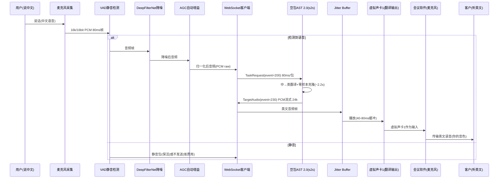
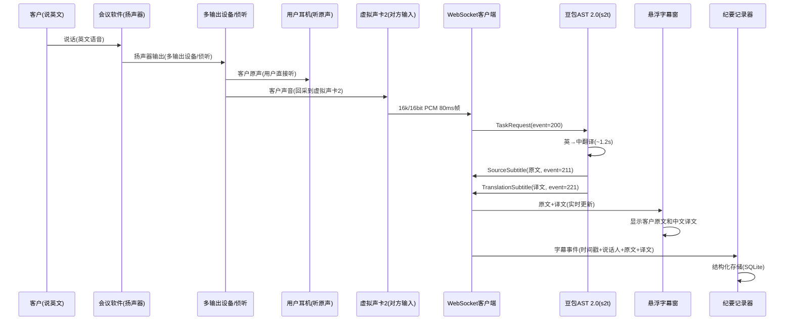

<title>实时中英双向同传软件（音色克隆版）项目架构与技术栈设计</title>

> 部分内容由豆包生成

# 整体架构设计

## 设计原则

- **分层解耦**：UI层、应用层、引擎层、音频层、云服务层严格分离，层间通过明确接口通信，可独立替换和测试
- **引擎核心化**：同传引擎（A/B通道+降噪+音频路由）作为核心独立模块，UI层仅负责展示和控制，确保核心链路稳定
- **跨平台抽象**：音频设备、系统托盘、全局快捷键等平台相关能力通过抽象接口封装，上层代码跨平台复用
- **隐蔽性优先**：系统托盘常驻、全局快捷键、无提示音、字幕窗可隐藏等设计从架构层面支持
- **可观测性**：四通道电平监控、连接状态、网络延迟、会话时长、翻译次数等实时监控内置
- **容错设计**：网络重连、音频设备热插拔、异常恢复、降级策略（如B通道失败不影响A通道）

## 五层分层架构

```mermaid
graph TB
    subgraph L1["L1 UI展现层 (Electron + React)"]
        A1[系统托盘 Tray]
        A2[悬浮字幕窗 Overlay]
        A3[控制面板 Control]
        A4[监控面板 Monitor]
        A5[设置面板 Settings]
        A6[纪要历史页 History]
    end
    subgraph L2["L2 应用服务层 (Node.js)"]
        B1[会话管理器 Session]
        B2[设备管理器 Device]
        B3[全局快捷键 Hotkey]
        B4[纪要管理器 Recorder]
        B5[配置持久化 Config]
        B6[日志系统 Logger]
    end
    subgraph L3["L3 音频设备层 (Native Addon C++/Rust)"]
        C1[麦克风采集 Capture]
        C2[虚拟声卡输出 VAC-Out]
        C3[虚拟声卡输入 VAC-In]
        C4[耳机播放 Render]
        C5[电平监控 VU-Meter]
        C6[系统音频回采 Loopback]
    end
    subgraph L4["L4 同传引擎层 (Native + Node.js)"]
        D1[A通道 中→英 s2s]
        D2[B通道 英→中 s2t]
        D3[DeepFilterNet降噪]
        D4[AGC自动增益]
        D5[Jitter Buffer 40-80ms]
        D6[重连管理器 Reconnect]
    end
    subgraph L5["L5 云服务层 (火山引擎)"]
        E1[豆包AST 2.0 wss]
        E2[零样本音色克隆]
        E3[术语库 热词+正则]
        E4[AI纪要 OpenAI兼容]
    end
    L1 -- IPC/数据绑定 --> L2
    L2 -- 函数调用/回调 --> L3
    L3 -- PCM音频帧 --> L4
    L4 -- WebSocket二进制帧 --> L5
    L5 -- PCM流式/字幕事件 --> L4
    L4 -- 音频帧/事件 --> L3
    L3 -- 音频数据 --> L2
    L2 -- 状态/数据 --> L1
```



## 各层职责详解

### L1 UI 展现层

基于 Electron + React + TypeScript + Tailwind CSS 构建，负责所有用户界面展示和交互。

| 模块 | 职责 | 关键特性 |
|-|-|-|
| 系统托盘 | 应用常驻系统托盘，主窗口默认最小化 | 托盘菜单（开始/停止/设置/退出）、状态图标（未连接/已连接/异常）、点击展开主窗口 |
| 悬浮字幕窗 | 实时显示客户原文和译文的悬浮窗口 | 半透明（70%）、可拖拽、可缩放、可隐藏（Ctrl+Alt+H）、置顶显示、字号可调、显示模式（仅译文/原文+译文/仅原文） |
| 控制面板 | 同传会话控制 | 开始/停止、快停快开（暂停/恢复）、静音我方、静音对方、清空、设置入口 |
| 监控面板 | 实时状态监控 | 连接状态、网络延迟（RTT+端到端）、会话时长、翻译次数、四通道电平表 |
| 设置面板 | 所有可配置项 | 音频设备（4个下拉+刷新+电平表）、翻译引擎（音色/语言/输出格式/denoise）、快捷键（自定义）、字幕（字号/透明度/位置）、纪要（AI Key/模板/自动录制）、关于 |
| 纪要历史页 | 历史会议记录管理 | 会议列表（时间/时长/翻译次数）、回放（音频+字幕同步）、导出（Word/SRT/TXT/JSON）、删除 |

### L2 应用服务层

基于 Node.js 构建，负责业务逻辑编排和状态管理，是 UI 层和底层（音频/引擎/云）之间的桥梁。

| 模块 | 职责 | 关键设计 |
|-|-|-|
| 会话管理器 | 管理同传会话生命周期和状态机 | 状态：未连接→连接中→已连接→暂停→重连中→异常；开始/停止/暂停/恢复；会话时长计时；翻译次数计数；事件总线（状态变化通知UI） |
| 设备管理器 | 音频设备枚举、检测、自动配置 | 枚举系统所有输入/输出设备；检测虚拟声卡（VB-Cable/BlackHole）是否安装；设备热插拔监听；推荐设备组合（防回环校验）；一键自动配置（Mac多输出设备/Win侦听） |
| 全局快捷键 | 注册和管理全局热键 | 6组默认快捷键（开始/停止、暂停/恢复、静音我方、静音对方、显隐字幕、切原声）；用户可自定义；跨平台（electron-localshortcut）；快捷键冲突检测和提示 |
| 纪要管理器 | 会议音频录制、双语原文存储、AI纪要生成 | 音频录制（wav/mp3，混合A+B通道）；双语原文结构化存储（时间戳/说话人/原文/译文，SQLite）；AI纪要生成（可配置AI Key+模板，调用OpenAI兼容API）；导出（Word左右对照/SRT/TXT/JSON） |
| 配置持久化 | 用户配置的本地存储和加密 | 配置文件（JSON，用户目录）；API Key加密存储（safeStorage）；配置版本管理和迁移；默认配置和重置 |
| 日志系统 | 分级日志记录和脱敏 | 分级（debug/info/warn/error）；日志轮转（按大小/日期）；脱敏（不记录音频内容和翻译文本，仅记录元数据）；诊断信息导出（一键打包日志供排查） |

### L3 音频设备层

基于 C++ 或 Rust 编写的 Node.js Native Addon，封装跨平台音频 API（Windows WASAPI / macOS CoreAudio），提供低延迟音频采集和播放。

| 模块 | 职责 | 技术细节 |
|-|-|-|
| 麦克风采集 | 从真实麦克风采集音频 | 格式：16kHz/16bit/mono PCM；帧大小：80ms（2560字节）；低延迟模式（WASAPI Exclusive / CoreAudio Low Latency）；VAD语音活动检测（静音检测，省API费用） |
| 虚拟声卡输出 | 翻译后的英文音频输出到虚拟声卡1 | 格式：24kHz/16bit/mono PCM（AST 2.0输出）；播放设备：CABLE-B Input（Win）/ BlackHole 2ch（Mac）；Jitter Buffer 40\~80ms抗抖动；音量控制 |
| 虚拟声卡输入 | 从虚拟声卡2采集客户声音（回采） | 格式：16kHz/16bit/mono PCM（重采样）；采集设备：CABLE Output（Win）/ VB-Cable（Mac）；系统音频回采（WASAPI loopback / ScreenCaptureKit） |
| 耳机播放 | 中文翻译播报和客户原声播放到耳机 | 格式：24kHz/16bit/mono PCM；播放设备：用户耳机；音量控制；可选B通道TTS播报（默认仅字幕，播报可开关） |
| 电平监控 | 四通道实时音量电平计算 | RMS电平计算（每10ms更新）；峰值检测；VU表UI数据；静音检测（电平低于阈值持续500ms判定为静音） |
| 系统音频回采 | 采集系统播放的音频（会议软件扬声器输出） | Windows：WASAPI loopback（采集指定进程或系统输出）；macOS：ScreenCaptureKit（12.0+）或多输出设备+BlackHole；用于B通道客户声音采集 |

### L4 同传引擎层

核心模块，负责音频处理和同传翻译。A/B通道独立运行，互不影响。

| 模块 | 职责 | 技术细节 |
|-|-|-|
| A通道（中→英 s2s） | 用户中文语音→英文语音输出（克隆音色） | 豆包AST 2.0 s2s模式；source_language=zh, target_language=en；speaker_id=""（零样本克隆）；target_audio.format=pcm, rate=24000；denoise=false（保留音色细节）；端到端延迟2.6\~2.9s |
| B通道（英→中 s2t） | 客户英文语音→中文字幕 | 豆包AST 2.0 s2t模式；source_language=en, target_language=zh；不需要target_audio；返回SourceSubtitle（原文）和TranslationSubtitle（译文）；spk_chg说话人识别；端到端延迟\~1.5s |
| DeepFilterNet降噪 | 本地实时降噪，抑制环境杂音 | 模型：DeepFilterNet（DFNet），ONNX Runtime部署；输入：16kHz/16bit/mono PCM；推理延迟：\~10ms/帧；CPU占用：\~5%；效果：抑制键盘声、空调声、背景人声等；仅对A通道输入降噪（B通道用服务端降噪或本地降噪可选） |
| AGC自动增益 | 输入电平归一化，确保音量稳定 | 目标电平：-16dBFS；增益范围：-12dB \~ +12dB；响应时间：快攻慢释（attack 5ms, release 100ms）；防止爆音（limiter峰值限制-3dBFS）；仅对A通道输入处理 |
| Jitter Buffer | 网络抖动缓冲，保证播放流畅 | 缓冲大小：40\~80ms（自适应）；自适应算法：根据网络抖动和延迟动态调整；欠载处理：播放静音（不中断）；过载处理：丢弃旧帧；仅对A通道输出（虚拟声卡播放）使用 |
| 重连管理器 | 网络异常时自动重连 | 触发条件：WebSocket断开/超时/错误；重连策略：指数退避（1s→2s→4s，最多3次）；重连期间：缓存音频帧（最多10s），恢复后补发；音色保持：重连后重新发送音色参考音频；状态通知：UI显示"重连中" |

### L5 云服务层

火山引擎提供的云端AI服务，通过WebSocket/REST API调用。

| 服务 | 用途 | 调用方式 |
|-|-|-|
| 豆包AST 2.0同传 | 端到端语音翻译（s2s/s2t） | WebSocket：wss://openspeech.bytedance.com/api/v4/ast/v2/translate；Resource ID: volc.service_type.10053；鉴权：X-Api-App-Key / X-Api-Access-Key |
| 零样本音色克隆 | 用用户本人音色输出英文翻译 | AST 2.0内置，speaker_id=""（空字符串触发零样本克隆）；无需单独训练；首次连接后模型自动从输入音频提取音色特征 |
| 术语库 | 专业术语翻译准确 | corpus.boosting_table_id（热词表，提升特定词汇识别率）；corpus.regex_correct_table_id（正则替换，翻译后文本替换）；在火山控制台创建词表，传入ID即可 |
| AI纪要（可配置） | 会议纪要生成 | 用户配置自己的API Key（豆包/OpenAI/通义/DeepSeek，任何OpenAI兼容API）；工具仅负责调用，不经过平台；支持自定义提示词模板 |

# 技术栈选型

## 桌面框架选型：Electron vs Tauri

| 维度 | Electron（推荐） | Tauri |
|-|-|-|
| 技术栈 | Node.js + Chromium + 原生模块 | Rust + WebView（系统自带） |
| 安装包大小 | \~80MB（含Chromium） | \~5MB（用系统WebView） |
| 内存占用 | \~150MB | \~30MB |
| 音频生态 | 丰富（naudiodon、speaker、mic等） | 较新，需自己写Rust音频封装 |
| Native Addon | 成熟（N-API / node-ffi） | Rust原生，无需Addon |
| 开发效率 | 高（JS/TS全栈，生态成熟） | 中（需Rust技能，UI用Web技术） |
| 跨平台一致性 | 高（Chromium统一渲染） | 中（依赖系统WebView，Win/Mac有差异） |
| 自动更新 | 成熟（electron-updater） | 有（tauri-updater），较新 |
| 适合场景 | 快速开发、丰富生态、团队熟悉JS | 极致轻量、Rust团队、对包大小敏感 |

<callout emoji="✅">
**推荐 Electron**：本项目核心是音频处理和同传引擎，UI相对简单。Electron 的 Node.js 音频生态成熟，开发效率高，跨平台一致性好。包大小和内存占用对于桌面工具来说可接受。Tauri 的 Rust 音频封装需要额外开发，降低开发效率。
</callout>

## 完整技术栈清单

| 层级 | 技术 | 版本 | 用途 |
|-|-|-|-|
| 桌面框架 | Electron | 28+ | 跨平台桌面应用容器 |
| UI框架 | React | 18+ | 组件化UI开发 |
| 语言 | TypeScript | 5+ | 类型安全 |
| 样式 | Tailwind CSS | 3+ | 原子化CSS，高效样式开发 |
| 状态管理 | Zustand | 4+ | 轻量状态管理（比Redux简单） |
| 音频引擎 | Node.js Native Addon（C++） | N-API | 低延迟音频采集/播放，封装WASAPI/CoreAudio |
| 降噪 | DeepFilterNet + ONNX Runtime | DFNet 0.5.6 | 本地实时AI降噪 |
| WebSocket | ws | 8+ | 与豆包AST 2.0通信，支持二进制帧 |
| 存储 | better-sqlite3 | 9+ | 本地结构化存储会议记录 |
| 配置 | electron-store | 8+ | 用户配置持久化（JSON） |
| 加密 | electron safeStorage | 内置 | API Key加密存储 |
| 全局快捷键 | electron-localshortcut | 3+ | 全局热键注册 |
| 系统托盘 | Electron Tray API | 内置 | 系统托盘集成 |
| 音频录制 | Native Addon（lame/mp3lame） | — | 录制会议音频为wav/mp3 |
| AI纪要 | OpenAI SDK（兼容多提供商） | 4+ | 统一接口调用豆包/OpenAI/通义/DeepSeek |
| 日志 | electron-log | 5+ | 分级日志+轮转 |
| 自动更新 | electron-updater | 6+ | 应用自动更新 |
| 构建打包 | electron-builder | 24+ | Win/Mac安装包构建和签名 |
| 开发工具 | Vite + electron-vite | 最新 | 热更新开发环境 |
| 代码质量 | ESLint + Prettier | 最新 | 代码规范和格式化 |

## 音频解码技术选型（关键）

豆包 AST 2.0 s2s 模式返回 **ogg_opus 48000Hz** 格式（PCM直出目前API不生效），需要本地解码为 PCM 后播放。解码质量直接影响输出音质。

### 解码库对比

| 方案 | 解码延迟 | 音质 | 依赖 | 适用阶段 | 推荐 |
|-|-|-|-|-|-|
| **soundfile (libsndfile)** | ~5ms/句 | 一般 | pip install soundfile | 验证阶段 | ✅ 当前验证用 |
| **pyogg (libogg+libopus)** | ~1ms/句 | 好 | 需装libogg+libopus原生库 | 生产阶段 | **✅ 推荐生产** |
| **opuslib (libopus)** | ~0.06ms/包 | 最好 | 需装libopus，需自己解析OGG容器 | 极致优化 | 备选 |
| **ruopus** | ~0.1ms/包 | 好 | 需装libopus，NumPy互操作 | 生产阶段 | 备选 |
| **ffmpeg子进程** | ~10ms/句 | 最好 | 需系统安装ffmpeg | 备选 | 不推荐（子进程开销） |

### 推荐方案

**验证阶段：soundfile**
- 优点：pip直接安装，无需原生依赖，快速验证
- 缺点：经libsndfile间接解码，音质一般，句末解码增加200-500ms延迟
- 当前验证脚本已跑通

**生产阶段：pyogg**
- 优点：OGG容器+Opus解码一体，直接调用libopus原生解码，音质好，延迟低
- 缺点：需要安装libogg+libopus原生库（macOS: brew install libogg opus; Windows: 预编译dll）
- 支持流式解码（OpusFileStream），可进一步降低延迟

**极致优化：opuslib + 自研OGG解析**
- 优点：最底层，延迟最低（~60μs/包），可逐包解码而非整句解码
- 缺点：需要自己解析OGG容器提取Opus数据包，开发复杂度高
- 适合对延迟要求极高的场景

### 播放技术选型（已验证）

| 技术 | 说明 | 状态 |
|-|-|-|
| **sounddevice.RawOutputStream** | 直接写原始字节，零numpy转换，低延迟模式 | ✅ 已验证（参考Doppelvoice实现） |
| bytearray环形缓冲 + 锁 | 零拷贝，蓄能机制防underrun爆音 | ✅ 已验证 |
| Jitter Buffer 100-150ms | 首次蓄能后播放，underrun后降阈值重启 | ✅ 已验证 |
| 缓冲上限30秒 | 超上限丢最早数据防漂移 | ✅ 已验证 |

### 验证阶段 vs 生产阶段技术栈差异

| 维度 | 验证阶段（当前） | 生产阶段（推荐） |
|-|-|-|
| 语言 | Python 3.11 | TypeScript (Electron主进程) + C++/Rust Native Addon |
| 音频采集/播放 | sounddevice (PortAudio) | Node.js Native Addon (WASAPI/CoreAudio) |
| Opus解码 | soundfile (libsndfile) | pyogg (libogg+libopus) 或原生C++解码 |
| 降噪 | 未集成（服务端denoise=false） | DeepFilterNet + ONNX Runtime 本地实时降噪 |
| GUI | 控制台 | Electron + React + Tailwind CSS |
| 虚拟声卡 | BlackHole (macOS) | BlackHole (macOS) / VB-Cable (Windows) |
| 配置 | 硬编码 | electron-store 持久化 + 设置面板 |
| 会议纪要 | 未实现 | 录制wav + 对话原文 + 可配置AI Key + 自定义模板 |
| 日志 | print | electron-log 分级+轮转 |

# 模型选型

## 同传模型：豆包 AST 2.0

### 选型对比

| 模型 | 厂商 | S2S首音延迟 | 零样本克隆 | PCM流式 | 术语库 | **推荐** |
|-|-|-|-|-|-|-|
| Doubao AST 2.0 | 火山引擎 | 2.53s | ✅ 内置 | ✅ 支持 | ✅ 热词+正则 | **✅ 首选** |
| Qwen3.5 同传 | 阿里云 | \~2.8s | ❌ 不支持 | 部分 | 部分 | 备选 |
| 讯飞同传 | 科大讯飞 | \~3s | ✅ 需训练 | 部分 | ✅ | 备选 |
| FunASR+NLLB+CosyVoice | 开源自建 | 3\~8s | ✅ CosyVoice | 需自建 | 需自建 | 不推荐（延迟高） |

### 豆包 AST 2.0 核心参数

| 参数 | A通道（s2s 中→英） | B通道（s2t 英→中） |
|-|-|-|
| request.mode | s2s（语音到语音） | s2t（语音到文本） |
| source_language | zh | en |
| target_language | en | zh |
| speaker_id | ""（空=零样本克隆） | 不需要 |
| source_audio.format | wav, rate=16000, bits=16, channel=1 | 同左 |
| target_audio.format | **ogg_opus, rate=48000**（实测：PCM格式API目前不生效，必须用ogg_opus） | 不需要 |
| denoise | false（保留音色细节，本地已降噪） | true（可选，服务端降噪） |
| corpus.boosting_table_id | 热词表ID（可选） | 同左 |
| corpus.regex_correct_table_id | 正则替换表ID（可选） | 同左 |
| 音频包大小 | 80ms/包（16kHz 16bit mono = 2560字节） | 同左 |
| 静音处理 | 持续发静音包保活（VAD可省费用） | 同左 |

### WebSocket 接口地址与鉴权

- **接口地址**：wss://openspeech.bytedance.com/api/v4/ast/v2/translate
- **Resource ID**：volc.service_type.10053
- **鉴权头**：  

  - X-Api-App-Key：应用APP Key
  - X-Api-Access-Key：访问密钥
  - X-Api-Resource-Id：volc.service_type.10053
  - X-Api-Connect-Id：uuid4（每次连接唯一）

### 事件码与消息流

| 事件码 | 名称 | 方向 | 说明 |
|-|-|-|-|
| 100 | StartSession | 客户端→服务端 | 开始会话，携带所有配置参数（mode/language/speaker_id/audio_format/denoise/corpus等） |
| 101 | SessionStarted | 服务端→客户端 | 会话已开始，确认参数 |
| 200 | TaskRequest | 客户端→服务端 | 发送音频数据包（每80ms一包，PCM raw二进制） |
| 210 | SourceSubtitleStart | 服务端→客户端 | 原文识别开始（含spk_chg说话人变化标记） |
| 211 | SourceSubtitle | 服务端→客户端 | 原文识别结果（流式，逐步更新） |
| 212 | SourceSubtitleComplete | 服务端→客户端 | 原文识别完成（一句结束） |
| 220 | TranslationSubtitleStart | 服务端→客户端 | 译文开始 |
| 221 | TranslationSubtitle | 服务端→客户端 | 译文结果（流式） |
| 222 | TranslationSubtitleComplete | 服务端→客户端 | 译文完成（翻译次数+1） |
| 230 | TargetAudio | 服务端→客户端 | 目标语音数据包（s2s模式，PCM流式，24kHz） |
| 900 | FinishSession | 客户端→服务端 | 结束会话 |
| 901 | SessionFinished | 服务端→客户端 | 会话已结束 |
| 999 | Error | 服务端→客户端 | 错误（含错误码和消息） |

## 零样本音色克隆

### 原理

豆包 AST 2.0 的零样本克隆（Zero-shot Voice Cloning）无需预先训练音色模型。当 `speaker_id=""`（空字符串）时，模型会从用户输入的中文语音中自动提取音色特征（音色、韵律、情感），并在输出英文翻译时保持这些特征。

### 关键特性

- **无需训练**：不需要预先录制和训练音色，首次说话后模型自动提取
- **实时克隆**：音色特征随输入实时更新，能反映用户当前的情绪和语气
- **情感保持**：用户生气/高兴/严肃时，英文输出也会保持相应情感（豆包APP体验到的效果）
- **限制**：重连后模型重新采样音色，可能出现轻微漂移；需要稳定的网络连接减少重连

### 与预训练音色的区别

| 维度 | 零样本克隆（本方案） | 预训练音色（speaker_id） |
|-|-|-|
| 训练要求 | 无需训练，实时提取 | 需预先录制音频训练（声音复刻2.0） |
| 音色稳定性 | 随输入实时变化，重连可能漂移 | 固定音色，稳定一致 |
| 情感保持 | ✅ 实时保持用户情绪 | ❌ 固定音色，情感表达有限 |
| AST 2.0支持 | ✅ 支持（speaker_id=""） | ❌ 仅支持2个公版音色，不支持自定义训练音色 |
| 适用场景 | 实时对话、情感交流、商务会议 | 固定播报、导航、有声书 |

<callout emoji="💡">
**重要限制**：豆包 AST 2.0 的指定音色模式（speaker_id非空）仅支持 2 个公版音色（zh_female_vv_uranus_bigtts / zh_male_jingqiangkanye_emo_mars_bigtts），**不支持用户在声音复刻2.0中训练的自定义音色**。因此零样本克隆是本项目唯一可行的音色克隆方案。
</callout>

## 降噪模型：DeepFilterNet

### 选型理由

- **开源免费**：MIT协议，可商用
- **轻量高效**：模型大小\~2MB，CPU实时推理（\~10ms/帧），无需GPU
- **效果优秀**：基于深度学习，抑制非稳态噪声（键盘声、背景人声、空调声）效果优于传统降噪（RNNoise/WebRTC NS）
- **ONNX部署**：提供ONNX模型，可在Node.js Native Addon中用ONNX Runtime集成
- **低延迟**：帧内处理，无算法延迟（区别于需要lookahead的算法）

### 部署架构

- **模型**：DeepFilterNet DFNet 0.5.6（16kHz版本）
- **推理引擎**：ONNX Runtime（C++，编译为Node.js Native Addon）
- **输入**：16kHz/16bit/mono PCM，80ms帧（2560字节）
- **输出**：16kHz/16bit/mono PCM，降噪后音频
- **处理位置**：A通道输入（麦克风采集后，发送给AST之前）
- **CPU占用**：\~5%（单核），内存\~20MB

### 为什么本地降噪而不是服务端降噪

| 维度 | 本地降噪（本方案） | 服务端降噪（denoise=true） |
|-|-|-|
| 音色影响 | 输入干净→零样本克隆输出也干净，保留音色细节 | 服务端降噪会磨平音色细节，克隆效果变差 |
| 延迟 | \~10ms（可忽略） | 增加服务端处理时间 |
| 成本 | 免费（本地CPU） | 含在API费用中 |
| 效果可控 | 可调整降噪强度，可选择开/关 | 固定效果，不可调 |
| 推荐 | **✅ 本地降噪 + denoise=false** | 不推荐（影响音色） |

## AI纪要模型（可配置）

会议纪要功能不绑定固定AI模型，用户可配置自己的API Key，支持任何OpenAI兼容格式的API：

- **豆包**（火山方舟，doubao-pro / doubao-lite）
- **OpenAI**（gpt-4o / gpt-4o-mini / gpt-3.5-turbo）
- **通义千问**（qwen-max / qwen-plus / qwen-turbo）
- **DeepSeek**（deepseek-chat / deepseek-coder）
- **任何OpenAI兼容API**（自定义base_url，如本地部署的Ollama/vLLM）

工具仅负责：①把会议全文（双语对照）填入用户自定义的提示词模板；②调用用户配置的AI API；③显示和导出生成结果。AI调用费用由用户直接付给API提供商，不经过本工具平台。

# 数据流转设计

## A通道完整数据流（你说中文 → 客户听英文）



### A通道各环节数据格式

| 环节 | 数据格式 | 采样率 | 位深 | 声道 | 帧大小 |
|-|-|-|-|-|-|
| 麦克风采集 | PCM raw | 16kHz | 16bit | mono | 80ms (2560字节) |
| 降噪/AGC后 | PCM raw | 16kHz | 16bit | mono | 80ms (2560字节) |
| WebSocket上行 | 二进制帧(PCM raw) | 16kHz | 16bit | mono | 80ms/包 |
| AST输出 | PCM raw (流式) | 24kHz | 16bit | mono | 流式(不等长) |
| Jitter Buffer后 | PCM raw | 24kHz | 16bit | mono | 10ms (480字节) |
| 虚拟声卡1播放 | PCM raw | 24kHz | 16bit | mono | 10ms/回调 |

## B通道完整数据流（客户说英文 → 你看中文字幕）



### B通道各环节数据格式

| 环节 | 数据格式 | 说明 |
|-|-|-|
| 虚拟声卡2采集 | PCM raw | 16kHz/16bit/mono，80ms帧（从48kHz重采样） |
| WebSocket上行 | 二进制帧 | PCM raw，80ms/包 |
| 原文事件 | JSON | SourceSubtitleStart/Complete，含text、spk_chg |
| 译文事件 | JSON | TranslationSubtitleStart/Complete，含text |
| 字幕窗显示 | UI渲染 | 原文（英文）+ 译文（中文），流式更新，自动滚动 |
| 纪要存储 | SQLite | {meeting_id, timestamp, speaker, source_text, translation_text} |

## 旁路：会议记录数据流

会议记录作为旁路流程，与A/B主链路并行，不影响主链路延迟：

1. **音频录制**：A通道输入（用户麦克风）+ B通道输入（客户声音）混合录制为 wav/mp3 文件
2. **双语原文记录**：监听AST的SourceSubtitleComplete和TranslationSubtitleComplete事件，结构化存储到SQLite
3. **说话人标记**：A通道原文标记为"用户"，B通道原文标记为"客户"（基于通道来源，比spk_chg更准确）
4. **会后AI纪要**：用户点击"生成纪要"→ 从SQLite读取全文 → 填入用户模板 → 调用用户配置的AI API → 显示结果 → 可导出
5. **原始素材导出**：音频文件 + 双语原文（Word左右对照/SRT/TXT/JSON）

# 虚拟声卡配置设计

## Windows 配置方案

### 虚拟声卡安装

1. 下载 VB-Cable（https://vb-audio.com/Cable/），免费
2. 解压后右键以管理员身份运行 VBCABLE_Setup_x64.exe
3. 点击 Install Driver，安装完成后重启电脑
4. 此时系统有一个虚拟声卡：CABLE Input（播放设备）+ CABLE Output（录音设备）
5. 需要第二个虚拟声卡：安装 VB-Cable B（同样管理员安装+重启），或下载 VB-Cable A+B 额外包
6. 最终有两个虚拟声卡：CABLE 和 CABLE-B

### B通道回采配置（客户声音 → 同传软件 + 耳机）

**方案A：Windows "侦听"功能（简单，推荐）**

1. 右键任务栏音量图标 → 声音 → 录制选项卡
2. 找到 CABLE Output → 右键 → 属性
3. 切换到"侦听"选项卡
4. 勾选"侦听此设备"
5. "通过此设备播放"下拉选你的耳机
6. 点击确定
7. 把系统默认播放设备（或会议软件扬声器）设为 CABLE Input

效果：客户声音 → 会议软件扬声器(CABLE Input) → CABLE Output → 同时到你的耳机（侦听）和同传软件（③对方声音输入采集）

**方案B：VoiceMeeter Banana（灵活，高级用户）**

1. 下载安装 VoiceMeeter Banana
2. Hardware Input 1 = 你的麦克风
3. Virtual Input = 会议软件扬声器（系统默认播放设为 VoiceMeeter Input）
4. Hardware Out A1 = 你的耳机
5. Virtual Out B1 = 同传软件"对方声音输入"
6. 路由：Virtual Input → A1（耳机）+ B1（同传软件）

### A通道输出配置（翻译 → 会议软件）

1. 同传软件"翻译输出"选 CABLE-B Input
2. 会议软件（Zoom/Teams/腾讯会议）麦克风选 CABLE-B Output
3. 会议软件扬声器选 CABLE Input（用于B通道回采）

## macOS 配置方案

### 虚拟声卡安装

1. 安装 BlackHole 2ch（brew install blackhole-2ch 或下载 pkg）
2. 安装时提示"已阻止来自 Existential Audio Inc. 的系统软件"→ 系统设置 → 隐私与安全性 → 滚到底部 → 点"允许"→ 重启 Mac
3. 安装 VB-Cable for Mac（https://vb-audio.com/Cable/），同样允许系统软件后重启
4. 验证：应用 → 实用工具 → 音频 MIDI 设置，左侧能看到 BlackHole 2ch 和 VB-Cable

### 多输出设备创建（关键）

1. 打开 音频 MIDI 设置（应用 → 实用工具 → 音频 MIDI 设置）
2. 左下角点 + → 选"创建多输出设备"
3. 右侧勾选：BlackHole 2ch（或 VB-Cable，用于回采客户声音）+ 你的耳机/扬声器
4. 右键新建的"多输出设备" → 设为"将此设备用作声音输出"
5. 主设备（Master Device）设为你的耳机
6. 勾选 BlackHole 的"漂移校正"（Drift Correction）—— 不同设备时钟不同步，不校正会有爆音
7. 采样率设为 44100.0 Hz（所有设备一致）

效果：系统声音（含会议软件播放的客户声音）→ 多输出设备 → 同时到你的耳机（听客户原声）和 BlackHole（同传软件③对方声音输入采集）

### A通道输出配置

1. 同传软件"翻译输出"选 BlackHole 2ch
2. 同传软件"对方声音输入"选 VB-Cable
3. 会议软件（Zoom/Teams/腾讯会议）麦克风选 BlackHole 2ch
4. 会议软件扬声器选 多输出设备

## 各会议软件配置步骤

| 会议软件 | 麦克风设置路径 | 扬声器设置路径 |
|-|-|-|
| Zoom | 设置（齿轮）→ 音频 → 麦克风 → 选虚拟声卡1 | 设置 → 音频 → 扬声器 → 选耳机（Win）/多输出设备（Mac） |
| Microsoft Teams | 设置（...）→ 设备 → 麦克风 → 选虚拟声卡1 | 设置 → 设备 → 扬声器 → 选耳机/多输出设备 |
| 腾讯会议 | 设置（头像）→ 音频 → 麦克风 → 选虚拟声卡1 | 设置 → 音频 → 扬声器 → 选耳机/多输出设备 |
| 钉钉 | 设置 → 音频 → 麦克风 → 选虚拟声卡1 | 设置 → 音频 → 扬声器 → 选耳机/多输出设备 |
| 飞书会议 | 设置 → 音频 → 麦克风 → 选虚拟声卡1 | 设置 → 音频 → 扬声器 → 选耳机/多输出设备 |
| Google Meet | 会议中 → 更多 → 设置 → 音频 → 麦克风 → 选虚拟声卡1 |  |
| OBS | 设置 → 音频 → 桌面音频/麦克风 → 选虚拟声卡1 | 设置 → 音频 → 监控设备 → 选耳机 |

## 软件自动配置设计

为降低用户配置门槛，软件提供以下自动化能力：

1. **虚拟声卡检测**：启动时自动扫描系统已安装的虚拟声卡（CABLE/CABLE-B/BlackHole/VB-Cable），提示用户安装缺失的
2. **智能设备推荐**：根据已安装的虚拟声卡，自动推荐②翻译输出和③对方声音输入的组合（防回环校验：②≠③）
3. **Mac 多输出设备一键创建**：通过 AppleScript 调用系统音频 MIDI 设置 API，自动创建多输出设备（耳机+BlackHole），无需用户手动操作
4. **Windows 侦听一键开启**：通过注册表/PowerShell 自动配置 CABLE Output 的侦听设备为用户耳机
5. **会议软件配置引导**：内置 Zoom/Teams/腾讯会议等的配置图文指引，用户跟着点就行
6. **设备状态监控**：实时显示4个设备的连接状态和电平表，异常时高亮提示（如"翻译输出无信号""对方声音输入静音"）
7. **防回环校验**：如果用户把②和③选成了同一个虚拟声卡，软件自动警告并阻止启动

# 跨平台方案

## 平台差异抽象

| 能力 | Windows | macOS | 抽象接口 |
|-|-|-|-|
| 音频采集/播放 | WASAPI（Exclusive/Shared） | CoreAudio（AudioUnit） | AudioCapture / AudioRender 接口 |
| 系统音频回采 | WASAPI loopback | ScreenCaptureKit（12.0+）/ 多输出设备+BlackHole | SystemAudioCapture 接口 |
| 虚拟声卡 | VB-Cable（CABLE/CABLE-B） | BlackHole + VB-Cable | VirtualAudioDevice 枚举和检测 |
| 全局快捷键 | RegisterHotKey / electron-localshortcut | Carbon RegisterEventHotKey / electron-localshortcut | GlobalShortcut 接口 |
| 系统托盘 | Win32 Shell_NotifyIcon / Electron Tray | NSStatusItem / Electron Tray | Tray 接口（Electron统一） |
| 自动更新 | electron-updater（NSIS） | electron-updater（DMG） | AutoUpdater 接口（Electron统一） |
| 权限申请 | 麦克风权限（Windows 11） | 麦克风权限 + 屏幕录制权限（ScreenCaptureKit） | PermissionManager 接口 |
| 安装包签名 | 代码签名证书（EV推荐） | Developer ID + 公证（Notarization） | electron-builder 统一配置 |

## 开发策略

1. **先 Windows 后 Mac**：用户主要使用 Windows，先开发 Windows 版本验证功能和稳定性，再适配 macOS
2. **Native Addon 跨平台编译**：音频引擎用 C++ 编写，通过 N-API 封装为 Node.js Native Addon，Windows 用 WASAPI，Mac 用 CoreAudio，通过 #ifdef 平台宏区分
3. **UI 层 100% 复用**：Electron + React UI 层完全跨平台，无需修改
4. **平台特定配置引导**：设置面板根据当前平台显示对应的虚拟声卡配置引导（Windows显示VB-Cable+侦听，Mac显示BlackHole+多输出设备）
5. **统一测试**：两个平台都需要测试 Zoom/Teams/腾讯会议的兼容性，确保虚拟声卡能被正确识别和选择

# 目录结构设计

```text
real-time-translator/
├── src/
│   ├── main/                    # Electron 主进程
│   │   ├── index.ts             # 主进程入口
│   │   ├── ipc/                 # IPC 通信 handler
│   │   │   ├── session.ts       # 会话控制
│   │   │   ├── device.ts        # 设备管理
│   │   │   ├── recorder.ts      # 纪要管理
│   │   │   └── settings.ts      # 设置管理
│   │   ├── services/            # 应用服务层
│   │   │   ├── SessionManager.ts
│   │   │   ├── DeviceManager.ts
│   │   │   ├── HotkeyManager.ts
│   │   │   ├── RecorderManager.ts
│   │   │   ├── ConfigManager.ts
│   │   │   └── Logger.ts
│   │   └── tray.ts              # 系统托盘
│   ├── renderer/                # Electron 渲染进程（UI）
│   │   ├── index.html
│   │   ├── main.tsx             # React 入口
│   │   ├── App.tsx
│   │   ├── components/          # UI 组件
│   │   │   ├── ControlPanel/    # 控制面板
│   │   │   ├── MonitorPanel/    # 监控面板
│   │   │   ├── SubtitleWindow/  # 悬浮字幕窗
│   │   │   ├── SettingsPanel/   # 设置面板
│   │   │   ├── HistoryPage/     # 纪要历史页
│   │   │   └── common/          # 通用组件（按钮/电平表/等）
│   │   ├── store/               # Zustand 状态管理
│   │   └── styles/              # Tailwind + 全局样式
│   ├── native/                  # Native Addon（C++）
│   │   ├── binding.gyp          # node-gyp 构建配置
│   │   ├── src/
│   │   │   ├── addon.cpp        # N-API 入口
│   │   │   ├── audio_capture.h  # 音频采集抽象接口
│   │   │   ├── audio_render.h   # 音频播放抽象接口
│   │   │   ├── denoise.h        # 降噪接口
│   │   │   ├── win/             # Windows 实现（WASAPI）
│   │   │   └── mac/             # macOS 实现（CoreAudio）
│   │   └── models/              # DeepFilterNet ONNX 模型
│   ├── engine/                  # 同传引擎（Node.js）
│   │   ├── ChannelA.ts          # A通道（中→英 s2s）
│   │   ├── ChannelB.ts          # B通道（英→中 s2t）
│   │   ├── AstWebSocket.ts      # AST 2.0 WebSocket 封装
│   │   ├── JitterBuffer.ts      # 抖动缓冲
│   │   ├── ReconnectManager.ts  # 重连管理
│   │   └── VAD.ts               # 语音活动检测
│   ├── shared/                  # 共享类型和常量
│   │   ├── types.ts             # TypeScript 类型定义
│   │   ├── constants.ts         # 常量（默认配置/快捷键等）
│   │   └── ipc-channels.ts      # IPC 通道名
│   └── assets/                  # 静态资源（图标/托盘图标等）
├── package.json
├── electron-builder.yml         # 构建配置
├── tsconfig.json
├── vite.config.ts
└── README.md
```

# 关键接口设计

## IPC 接口（主进程 ↔ 渲染进程）

| 通道名 | 方向 | 参数 | 返回 | 说明 |
|-|-|-|-|-|
| session:start | 渲染→主 | {config} | {success, sessionId} | 开始同传会话 |
| session:stop | 渲染→主 | — | {success} | 停止同传会话 |
| session:pause | 渲染→主 | — | {success} | 暂停（快停，保连） |
| session:resume | 渲染→主 | — | {success} | 恢复 |
| session:mute-mic | 渲染→主 | {muted: boolean} | {success} | 静音/取消静音我方麦克风 |
| session:mute-other | 渲染→主 | {muted: boolean} | {success} | 静音/取消静音对方声音 |
| session:toggle-original | 渲染→主 | {original: boolean} | {success} | 切换原声/翻译模式 |
| session:state | 主→渲染 | {state, duration, translationCount, latency, connectionStatus} | — | 会话状态实时推送 |
| session:subtitle | 主→渲染 | {source, translation, speaker, isFinal} | — | B通道字幕实时推送 |
| session:level | 主→渲染 | {mic, vacOut, vacIn, headphone} | — | 四通道电平实时推送 |
| device:list | 渲染→主 | — | {inputs[], outputs[]} | 枚举音频设备 |
| device:detect-vac | 渲染→主 | — | {cable, cableB, blackhole, vbCable} | 检测虚拟声卡安装状态 |
| device:auto-config | 渲染→主 | {platform} | {success, message} | 一键自动配置（Mac多输出设备/Win侦听） |
| recorder:list | 渲染→主 | — | {meetings[]} | 获取历史会议列表 |
| recorder:generate-summary | 渲染→主 | {meetingId, templateId, modelConfig} | {summary} | 生成AI纪要 |
| recorder:export | 渲染→主 | {meetingId, format} | {filePath} | 导出会议素材（Word/SRT/TXT/JSON） |
| settings:get | 渲染→主 | — | {config} | 获取用户配置 |
| settings:set | 渲染→主 | {config} | {success} | 保存用户配置 |
| hotkey:register | 渲染→主 | {action, accelerator} | {success} | 注册全局快捷键 |

## 同传引擎内部接口

```typescript
interface ChannelAConfig {
  apiKey: string;          // 火山API Key
  apiSecret: string;       // 火山API Secret
  sourceLanguage: 'zh';    // 源语言
  targetLanguage: 'en';    // 目标语言
  speakerId: '';           // 空=零样本克隆
  inputDevice: string;     // 麦克风设备ID
  outputDevice: string;    // 虚拟声卡1设备ID
  denoise: boolean;        // 本地降噪开关
  agc: boolean;            // AGC开关
  jitterBufferMs: number;  // Jitter Buffer大小(40-80)
  vadEnabled: boolean;     // VAD静音检测开关
}

interface ChannelAState {
  connected: boolean;
  reconnecting: boolean;
  latencyMs: number;       // 端到端延迟
  networkRttMs: number;    // 网络RTT
  inputLevel: number;      // 麦克风电平(0-1)
  outputLevel: number;     // 虚拟声卡1电平
  muted: boolean;          // 麦克风静音状态
  paused: boolean;         // 暂停状态
}

class ChannelA {
  constructor(config: ChannelAConfig);
  start(): Promise<void>;
  stop(): void;
  pause(): void;           // 快停(保连)
  resume(): void;          // 恢复
  mute(muted: boolean): void;
  getState(): ChannelAState;
  on(event: 'state', cb: (state: ChannelAState) => void): void;
  on(event: 'error', cb: (error: Error) => void): void;
  on(event: 'translation-complete', cb: (text: string) => void): void;
}
```

```typescript
interface ChannelBConfig {
  apiKey: string;
  apiSecret: string;
  sourceLanguage: 'en';
  targetLanguage: 'zh';
  inputDevice: string;     // 虚拟声卡2设备ID(对方声音输入)
  outputDevice?: string;   // 耳机设备ID(可选TTS播报)
  enableTts: boolean;      // 是否启用中文播报(默认仅字幕)
  denoise: boolean;        // 服务端降噪
}

interface Subtitle {
  id: string;
  timestamp: number;       // 相对时间(ms)
  speaker: 'client' | 'unknown';
  sourceText: string;      // 英文原文
  translationText: string; // 中文译文
  isFinal: boolean;        // 是否最终结果
}

class ChannelB {
  constructor(config: ChannelBConfig);
  start(): Promise<void>;
  stop(): void;
  mute(muted: boolean): void;  // 静音对方声音采集
  getState(): { connected: boolean; inputLevel: number; muted: boolean };
  on(event: 'subtitle', cb: (subtitle: Subtitle) => void): void;
  on(event: 'state', cb: (state: any) => void): void;
  on(event: 'error', cb: (error: Error) => void): void;
}
```

---

*本文档为项目架构与技术栈设计详细说明，涵盖五层分层架构、模块职责、技术栈选型、模型选型、数据流转、虚拟声卡配置、跨平台方案和接口设计。具体性能指标和成本分析见《性能与成本分析报告》。*
