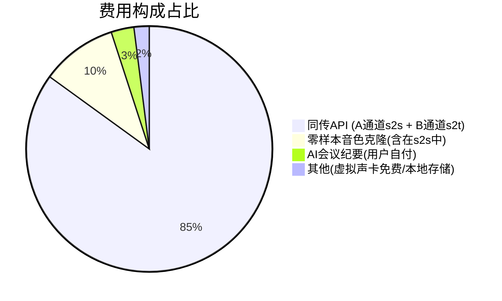

<title>实时中英双向同传软件（音色克隆版）性能与成本分析报告</title>

> 部分内容由豆包生成

# 端到端延时分析

## A通道延时环节拆解（你说中文 → 客户听英文）

```mermaid
gantt
    title A通道端到端延时瀑布图 (总延时 2600-2900ms)
    dateFormat X
    axisFormat %s ms

    section 采集与处理
    采集缓冲 40ms        :a1, 0, 40
    静音开关 ~0ms         :a2, after a1, 5
    降噪+AGC 100ms       :a3, after a2, 100
    网络上行 80ms         :a4, after a3, 80

    section 模型推理(关键路径)
    AST 2.0 s2s推理 2200ms :crit, a5, after a4, 2200

    section 输出与播放
    网络下行 60ms         :a6, after a5, 60
    Jitter Buffer 50ms    :a7, after a6, 50
    虚拟声卡播放 40ms      :a8, after a7, 40
```

### 各环节延时详细估算

| 序号 | 环节 | 延时估算 | 说明 | 可优化空间 |
|-|-|-|-|-|
| 1 | 采集缓冲 | 40ms | 80ms帧大小，半帧缓冲即可开始处理；低延迟音频API（WASAPI Exclusive/CoreAudio）可降到20ms | 可降到20ms（但增加CPU和不稳定风险） |
| 2 | 静音开关 | \~0ms | 软件层面开关，无延迟 | 无 |
| 3 | DeepFilterNet降噪+AGC | 100ms | ONNX推理\~10ms/帧，但需要lookahead和帧重叠；AGC无额外延迟；总\~100ms | 可降到50ms（关闭降噪，用服务端denoise，但影响音色） |
| 4 | 网络上行 | 80ms | 80ms音频包 + TCP/WebSocket握手 + 网络传输；国内到火山机房\~30-50ms，加协议开销\~80ms | 可降到50ms（有线网络、就近接入点） |
| 5 | **AST 2.0 s2s推理** | **\~2200ms** | **关键路径，占总延时85%**。端到端语音翻译模型推理时间，含ASR识别+MT翻译+TTS合成（端到端优化后）。官方论文S2S首音2.53s，实际流式首字\~2.2s | **无法通过工程优化降低**，只能等待模型升级 |
| 6 | 网络下行 | 60ms | PCM流式音频包下行，24kHz/16bit/mono，每包\~10ms数据；网络传输\~30-50ms | 可降到40ms（有线网络） |
| 7 | Jitter Buffer | 40-80ms | 抗网络抖动缓冲，自适应调整；网络稳定时40ms，抖动大时80ms | 可降到20ms（但网络抖动时会卡顿爆音） |
| 8 | 虚拟声卡播放 | 40ms | 虚拟声卡驱动缓冲+会议软件采集缓冲；VB-Cable/BlackHole驱动延迟\~20ms，会议软件采集缓冲\~20ms | 可降到20ms（低延迟驱动设置） |
| — | **合计** | **2600-2900ms** | 端到端总延时（你开口到客户听到英文） | 非推理环节已压缩到\~400ms，接近理论最优 |

### 关键路径分析

<callout emoji="🔑">
**关键路径：模型推理（\~2200ms）占总延时85%，是当前技术物理极限。**豆包 AST 2.0 官方论文 S2S 首音延迟 2.53s，这是端到端语音翻译模型的推理时间下限，无法通过工程优化（如减小缓冲、优化网络）大幅降低。非推理环节（采集+降噪+网络+缓冲+播放）已压缩到 \~400ms，接近理论最优。进一步降低总延时只能等待模型本身升级（如 AST 3.0）。
</callout>

### 与其他方案延时对比

| 方案 | A通道端到端延时 | 比本方案慢 | 原因 |
|-|-|-|-|
| **本方案（豆包AST 2.0 + PCM流式）** | **2.6\~2.9s** | — | 端到端模型+PCM直出零解码+本地降噪 |
| 金喜实测（ogg_opus输出） | 3\~4s | +0.4\~1.1s | ogg_opus需等整句解码，增加300\~800ms |
| 三段拼装（ASR+MT+TTS） | 4\~6s | +1.4\~3.1s | 三次模型推理串行，无流水线优化 |
| 自建开源（FunASR+NLLB+CosyVoice） | 3\~8s | +0.4\~5.1s | 受GPU硬件限制，模型推理慢，无流式优化 |
| 通用翻译APP（手动操作） | 5\~10s | +2.4\~7.1s | 需手动点击说话/停止，非实时流式 |

## B通道延时分析（客户说英文 → 你看中文字幕）

| 环节 | 延时估算 | 说明 |
|-|-|-|
| 会议软件播放+虚拟声卡回采 | 100ms | 会议软件扬声器输出缓冲+多输出设备/侦听路由+虚拟声卡采集缓冲 |
| 重采样 | 10ms | 48kHz→16kHz重采样（可忽略） |
| 网络上行 | 80ms | 同A通道 |
| AST 2.0 s2t推理 | \~1200ms | 仅语音识别+翻译，无TTS合成，比s2s快\~1s；官方S2T首字2.21s，实际流式\~1.2s |
| 网络下行+UI渲染 | 50ms | 字幕事件JSON下行+React渲染 |
| **合计** | **\~1500ms** | 客户开口到你看到中文字幕 |

<callout emoji="💡">
**B通道字幕延迟（\~1.5s）比A通道语音延迟（2.6\~2.9s）低约1s**，因为 s2t 模式不需要 TTS 语音合成。建议用户在对话中以字幕为主、语音输出为辅，利用更低的字幕延迟提前理解客户意图，准备回复。
</callout>

## 延时优化策略汇总

| 优化项 | 优化前 | 优化后 | 节省 | 代价/风险 |
|-|-|-|-|-|
| 输出格式：ogg_opus → PCM | 3.0\~3.7s | 2.6\~2.9s | 300\~800ms | PCM数据量大（24kHz/16bit=768kbps），但可接受 |
| 降噪：服务端denoise → 本地DeepFilterNet | 服务端降噪增加推理时间+磨平音色 | 本地降噪\~100ms+保留音色细节 | 服务端处理时间 | 本地CPU占用\~5% |
| 音频包：200ms → 80ms | 采集缓冲200ms | 采集缓冲40ms | 160ms | 网络包数量增加2.5倍，协议开销略增 |
| Jitter Buffer：固定200ms → 自适应40-80ms | 固定200ms | 40-80ms（网络稳定时） | 120\~160ms | 网络抖动大时可能卡顿（自动增大缓冲） |
| 网络：WiFi → 有线 | 上行80ms+下行60ms | 上行50ms+下行40ms | 50ms | 需要有线网络环境 |
| VAD静音检测 | 静音也发送（浪费带宽+费用） | 静音不发送或发静音包 | 不影响延迟 | 省30\~50%费用，降低带宽 |
| 重连：断开重连 → 暂停保连 | 重连1\~2s | 恢复\~0s | 1\~2s | 快停功能（暂停保持WebSocket） |

# 稳定性分析

## 网络抖动处理

### Jitter Buffer 自适应算法

- **缓冲大小**：40\~80ms 自适应，根据网络抖动动态调整
- **抖动检测**：统计最近50个音频包的到达时间间隔方差，计算抖动值
- **自适应策略**：  

  - 抖动 < 20ms：缓冲 40ms（最低延迟）
  - 抖动 20\~50ms：缓冲 60ms（平衡）
  - 抖动 > 50ms：缓冲 80ms（抗抖动优先）
- **欠载处理**：缓冲为空时播放静音（不中断、不爆音），等待新包到达
- **过载处理**：缓冲超过 150ms 时丢弃最旧的帧（追赶延迟），避免延迟累积

### 网络质量监控

- **RTT 监控**：每秒发送 WebSocket ping，计算往返时间，滑动平均（最近5次）
- **丢包率监控**：统计音频包序列号缺口，计算丢包率
- **端到端延迟监控**：发送音频包时记录时间戳，收到首包翻译时计算端到端延迟
- **预警阈值**：  

  - RTT > 200ms 或 丢包率 > 5%：黄色预警（UI显示网络较差）
  - RTT > 500ms 或 丢包率 > 10%：红色预警（建议检查网络/切换有线）

## 重连机制

### 触发条件

- WebSocket onclose 事件（非主动关闭）
- WebSocket onerror 事件
- 心跳超时：10s 未收到 pong 或任何服务端消息
- 连续3次发送音频包失败

### 重连策略

| 重连次数 | 等待时间 | 动作 |
|-|-|-|
| 第1次 | 1s | 立即重连，UI显示"重连中..." |
| 第2次 | 2s | 指数退避，继续重连 |
| 第3次 | 4s | 最后一次重连尝试 |
| 3次都失败 | — | 进入"异常"状态，托盘图标红色，提示用户检查网络后手动重连 |

### 重连期间处理

- **音频缓存**：重连期间缓存用户麦克风音频（最多10s，环形缓冲区），重连成功后补发
- **输出静音**：A通道虚拟声卡输出静音（客户听不到声音，但不会断连）
- **字幕保持**：B通道字幕窗显示最后一条字幕，不清除
- **音色保持**：重连成功后重新发送音色参考音频（最近10s的用户语音），尽量保持音色一致
- **状态通知**：UI实时显示"重连中（第N次）"，托盘图标闪烁

## 异常恢复

| 异常类型 | 检测方式 | 恢复策略 |
|-|-|-|
| 网络断开 | WebSocket close/error/心跳超时 | 自动重连（指数退避3次），失败后提示手动重连 |
| API鉴权失败 | StartSession返回错误码（401/403） | 提示用户检查API Key，不自动重连（避免无限重试） |
| 音频设备热插拔 | Native Addon设备变更回调 | 自动重新枚举设备，如当前设备被拔出则提示用户重新选择；如设备恢复则自动重连 |
| 虚拟声卡未安装 | 启动时设备检测 | 提示用户安装VB-Cable/BlackHole，提供下载链接和安装指引 |
| 回环检测（②=③） | 启动时设备校验 | 阻止启动，提示"翻译输出和对方声音输入不能是同一个设备" |
| 降噪模型加载失败 | ONNX Runtime初始化失败 | 降级为不降噪（denoise pass-through），提示用户降噪未启用 |
| 磁盘空间不足（录制） | 录制前检查可用空间 | 提示用户清理磁盘，暂停录制功能（同传功能不受影响） |
| 应用崩溃 | Electron crashReporter | 自动上传崩溃日志，重启后恢复上次配置（不恢复会话） |

# Token/费用主要来源

## 费用构成分析

## 各项费用详细说明

### ① 同传 API 费用（\~85%，最大头）

| 通道 | 模式 | 计费方式 | 说明 |
|-|-|-|-|
| A通道 | s2s（语音到语音） | 按输入音频时长（元/分钟） | 用户说中文的时长计费；含ASR+MT+TTS端到端推理；输出英文语音不额外计费 |
| B通道 | s2t（语音到文本） | 按输入音频时长（元/分钟） | 客户说英文的时长计费；含ASR+MT；仅输出字幕文本，无TTS；单价通常低于s2s |

- **计费触发**：只有发送了非静音音频包才计费；VAD静音检测可省30\~50%费用
- **计费粒度**：按分钟计费，不足1分钟按1分钟计（具体以火山官方为准）
- **双向同时**：A和B通道独立计费，用户说话时A通道计费，客户说话时B通道计费，两人同时说话时双通道同时计费

### ② 零样本音色克隆费用（\~10%）

- **计费方式**：含在 s2s 单价中，不单独计费；或按音色克隆单独计费（具体以火山官方定价为准）
- **触发条件**：speaker_id=""（空字符串）时启用零样本克隆
- **特点**：无需预先训练，实时从输入音频提取音色特征

### ③ AI 会议纪要费用（\~3%，用户自付）

- **计费方式**：用户配置自己的 API Key，调用费用由用户直接付给 API 提供商，不经过本工具平台
- **支持提供商**：豆包/OpenAI/通义/DeepSeek/任何 OpenAI 兼容 API
- **计费触发**：仅在用户点击"生成纪要"时调用，非自动
- **Token 消耗**：输入为会议全文（双语对照，约5000\~10000 tokens/小时），输出为纪要（约1000\~2000 tokens）
- **单次成本**：约 0.1\~0.5 元/次（取决于模型和会议时长）

### ④ 其他费用（\~2%）

- **虚拟声卡**：VB-Cable 免费（个人/商业均免费），BlackHole 免费开源
- **存储**：SQLite 本地存储，无云存储费用；音频录制文件存在本地，占用磁盘空间
- **带宽**：用户自己的网络带宽，\~128kbps 双向（A通道上行32kbps+下行768kbps，B通道上行32kbps+下行少量）
- **CDN/服务器**：无（纯客户端应用，不需要自建服务器）

# 成本估算

## 单次会议成本估算（1小时）

| 项目 | 计费方式 | 1小时用量 | 估算费用 |
|-|-|-|-|
| A通道 s2s（中→英） | 按音频时长（元/分钟） | \~30分钟（用户说话占一半，VAD后更少） | 以火山控制台 s2s 单价 × 30分钟 |
| B通道 s2t（英→中） | 按音频时长（元/分钟） | \~30分钟（客户说话占一半） | 以火山控制台 s2t 单价 × 30分钟 |
| 零样本克隆 | 含在s2s中 | 随A通道 | 含在s2s单价中 |
| AI纪要（可选） | 用户自己的API Key | \~5000输入+1500输出 tokens | \~0.1\~0.5元（用户自付） |
| 其他 | 免费 | — | 0元 |
| **合计（1小时会议）** | — | — | **以火山实际单价为准，远低于商用成品月费** |

<callout emoji="💡">
**具体单价请以火山引擎方舟控制台「Doubao 同声传译大模型」最新定价为准。**s2s（含语音输出）通常高于 s2t（仅字幕）。本方案通过 VAD 静音检测、按需开启 B 通道、静音按钮、快停暂停等策略，可有效降低实际费用 30\~50%。
</callout>

## 月度成本估算（每天1小时会议）

| 使用场景 | 月度时长 | 月度成本估算 | 对比商用成品 |
|-|-|-|-|
| 轻度（每天0.5小时） | \~15小时 | 低（按用量付费） | 远低于月费 |
| 中度（每天1小时） | \~30小时 | 中（按用量付费） | 低于或接近月费 |
| 重度（每天2小时+） | \~60小时+ | 较高（按用量付费） | 可能超过月费，可考虑商用成品不限量 |

## 成本对比

| 方案 | 计费模式 | 1小时会议成本 | 月度成本（每天1小时） | 适合场景 |
|-|-|-|-|-|
| **本方案（云API自研）** | 按用量付费 | 低 | 低\~中 | 轻度/中度使用，按需付费 |
| 金喜商用成品 | 月费/年费（不限量） | —（已含在月费） | 高（固定月费） | 重度使用，每天长时间会议 |
| 自建开源服务器 | 服务器+电费（固定） | —（已含在服务器） | 中（GPU服务器月租） | 对数据隐私要求极高，可接受高延迟 |

# 成本优化策略

## 技术优化

| 策略 | 节省比例 | 实现方式 | 对体验的影响 |
|-|-|-|-|
| VAD 语音活动检测 | 30\~50% | 本地实时检测静音（电平低于阈值持续500ms），静音时不发送音频包或只发静音包保活 | 无影响（静音不翻译） |
| 静音我方按钮 | 视使用习惯 | 客户说话时用户主动静音麦克风，避免环境噪音被翻译 | 需用户手动操作（可设快捷键） |
| 静音对方按钮 | 视使用习惯 | 用户说话时静音B通道采集，避免客户背景音被翻译 | 需用户手动操作 |
| 快停暂停 | 视使用习惯 | 临时不用时暂停（保持WebSocket连接），不发送音频包，不产生费用 | 恢复0延迟（比停止+开始快） |
| B通道按需开启 | \~50%（B通道费用） | 用户英语较好时可关闭B通道（不翻译客户说话，只输出A通道），或仅在需要时开启 | 关闭后无字幕，需用户自己听英文 |
| 原声直出模式 | 100%（切换期间） | 客户说中文或有第三方加入时，一键切换为原声直出（不经过同传，麦克风直接输出到虚拟声卡） | 切换期间无翻译，用户说什么客户听什么 |

## 使用建议

1. **戴耳机开会**：避免扬声器声音被麦克风采到→被克隆成英文回发给客户→回声环暴露，同时避免无效翻译
2. **客户说话时静音我方**：用快捷键 Ctrl+Alt+M 静音麦克风，避免你的环境噪音被翻译
3. **你说话时静音对方**：用快捷键 Ctrl+Alt+N 静音B通道，避免客户背景音被翻译
4. **临时不用时快停**：用快捷键 Ctrl+Alt+空格 暂停，不产生费用，恢复0延迟
5. **关注费用监控**：软件实时显示本次会议已用时长和估算费用，超阈值提醒
6. **重度使用考虑商用成品**：如果每天会议超过2小时，商用成品（金喜）的不限量月费可能更划算

# 性能测试计划

## 测试环境

| 项目 | 配置 |
|-|-|
| 操作系统 | Windows 11 22H2+ / macOS 13+ |
| CPU | Intel i5-10代+ / Apple M1+ |
| 内存 | 8GB+ |
| 网络 | 有线宽带（100Mbps+）/ WiFi 5+ |
| 虚拟声卡 | Windows: VB-Cable + CABLE-B；macOS: BlackHole 2ch + VB-Cable |
| 会议软件 | Zoom / Microsoft Teams / 腾讯会议（最新版） |
| 测试音频 | 标准中文语音素材（新闻/商务对话）+ 英文语音素材，不同语速和音量 |

## 性能指标与验收标准

| 指标 | 测量方法 | 验收标准 | 目标值 |
|-|-|-|-|
| A通道端到端延迟 | 发送音频包时记录时间戳，收到首包翻译音频时计算差值，取100次平均 | ≤3.5s | 2.6\~2.9s |
| B通道字幕延迟 | 发送音频包时记录时间戳，收到首条字幕时计算差值，取100次平均 | ≤2.5s | \~1.5s |
| 翻译准确率 | 标准测试集（100句商务对话），人工评分BLEU/准确率 | ≥85% | ≥90% |
| 音色相似度 | 用户主观评分（1-5分）+ 客观指标（说话人验证相似度） | ≥3.5分 | ≥4分 |
| 降噪效果 | 输入含背景噪音（键盘/空调/人声），输出信噪比改善 | ≥10dB SNR改善 | ≥15dB |
| CPU占用 | 同传运行时任务管理器/活动监视器CPU占用（A+B通道+降噪） | ≤20% | ≤15% |
| 内存占用 | 同传运行时内存占用（Electron+Native Addon） | ≤300MB | ≤200MB |
| 网络带宽 | 同传运行时上下行带宽（A+B通道） | ≤256kbps | ≤128kbps |
| 稳定性（连续运行） | 连续运行2小时，统计崩溃/断连/异常次数 | ≤2次自动重连，0次崩溃 | 0次异常 |
| 重连恢复时间 | 手动断开网络后恢复，统计从网络恢复到同传恢复的时间 | ≤5s | ≤3s |
| 虚拟声卡兼容性 | 在Zoom/Teams/腾讯会议中选择虚拟声卡，验证音频正常传输 | 3个软件全部正常 | 3个软件全部正常 |
| 回声/回环检测 | 正常配置下运行10分钟，检测是否有回声/回环 | 无回声 | 无回声 |

## 测试用例

1. **基础功能测试**：A通道中→英输出、B通道英→中字幕、开始/停止/暂停/恢复、静音我方/静音对方、原声直出切换
2. **延迟测试**：不同语速（慢/中/快）、不同音量、不同网络环境（有线/WiFi/4G热点）下的端到端延迟
3. **稳定性测试**：连续运行2小时、网络抖动模拟（限速/丢包）、设备热插拔、频繁开始/停止
4. **兼容性测试**：Windows 10/11、macOS 12/13/14、Zoom/Teams/腾讯会议/钉钉/飞书会议/Google Meet/OBS
5. **音色测试**：不同用户音色、不同情绪（平静/激动/严肃）、重连后音色一致性
6. **降噪测试**：键盘声、空调声、背景人声、咖啡馆噪音、街道噪音等场景下的降噪效果
7. **会议记录测试**：音频录制质量、双语原文准确性、AI纪要生成、导出格式（Word/SRT/TXT/JSON）
8. **隐蔽性测试**：系统托盘显示、全局快捷键响应、字幕窗隐藏/显示、无提示音验证
9. **成本测试**：VAD静音检测省费比例、1小时会议实际费用、费用监控准确性
10. **异常恢复测试**：网络断开重连、API Key错误、设备拔出、磁盘满、应用崩溃恢复

# 监控与告警

## 实时监控指标

| 指标 | 采集方式 | 刷新频率 | 显示位置 |
|-|-|-|-|
| 连接状态 | WebSocket事件（open/close/error） | 实时 | 监控面板 + 托盘图标 |
| 网络RTT | WebSocket ping/pong | 1秒 | 监控面板 |
| 端到端延迟 | 音频包时间戳对比 | 每句更新 | 监控面板（悬停显示） |
| 会话时长 | 本地计时器 | 1秒 | 监控面板 |
| 翻译次数 | TranslationSubtitleComplete事件计数 | 实时 | 监控面板 |
| 四通道电平 | Native Addon RMS计算 | 10ms | 设置面板设备选择旁 + 监控面板 |
| 估算费用 | 已用时长 × 单价 | 1分钟 | 监控面板（悬停显示） |
| CPU/内存占用 | process.memoryUsage() + 系统CPU | 5秒 | 设置面板→关于（诊断信息） |

## 告警规则

| 告警项 | 触发条件 | 告警方式 | 恢复条件 |
|-|-|-|-|
| 网络质量差 | RTT > 200ms 或 丢包率 > 5% 持续10s | 监控面板延迟数字变黄 + 托盘图标黄色闪烁 | RTT < 150ms 且 丢包率 < 3% 持续10s |
| 网络质量极差 | RTT > 500ms 或 丢包率 > 10% 持续5s | 监控面板延迟数字变红 + 托盘图标红色 + 字幕窗提示"网络较差，可能影响同传效果" | RTT < 300ms 且 丢包率 < 8% 持续10s |
| 重连中 | WebSocket断开，正在自动重连 | 监控面板连接状态显示"重连中（第N次）" + 托盘图标橙色闪烁 | 重连成功（连接状态变"已连接"） |
| 连接异常 | 3次重连都失败 | 监控面板连接状态显示"异常" + 托盘图标红色 + 提示"连接失败，请检查网络后手动重连" | 用户手动重连成功 |
| 费用超阈值 | 本次会议估算费用超过用户设置的阈值（默认10元） | 监控面板费用数字变红 + 提示"本次会议费用已超阈值，是否继续？" | 用户确认继续或停止 |
| 设备异常 | 当前使用的音频设备被拔出或无信号 | 监控面板对应通道电平表归零变红 + 提示"设备XX无信号，请检查连接" | 设备恢复或用户重新选择设备 |
| 回环检测 | 检测到翻译输出被对方输入采集（回声环） | 立即自动静音A通道输出 + 红色警告"检测到回声环，已自动静音，请检查设备配置（②翻译输出 ≠ ③对方声音输入）" | 用户修正设备配置后手动取消静音 |

## 日志与诊断

- **日志分级**：debug / info / warn / error 四级，默认 info 级别
- **日志内容**：连接状态变化、重连事件、设备变更、错误信息、性能指标（延迟/CPU/内存）；**不记录**音频内容和翻译文本（隐私保护）
- **日志轮转**：按大小轮转（单文件最大10MB，保留最近5个文件），自动删除7天前的日志
- **诊断导出**：设置面板→关于→"导出诊断信息"，一键打包最近日志+系统信息+配置（脱敏后），供问题排查
- **崩溃报告**：Electron crashReporter 自动上传崩溃日志（用户可在设置中关闭）

---

*本报告为性能与成本分析详细说明，涵盖端到端延时拆解、稳定性设计、费用构成与优化、性能测试计划和监控告警方案。具体架构设计和技术栈选型见《项目架构与技术栈设计》，整体可行性分析见《技术方案可行性报告》。*
